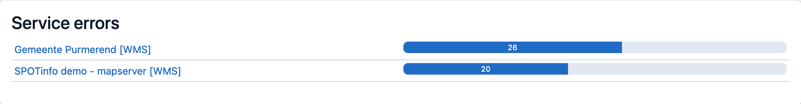

Het Dashboard biedt een overzicht van de huidige status van collecties, kaartlagen, services en gebruikersactiviteit
binnen MapGallery. Het is een handig hulpmiddel voor het monitoren van de prestaties en gebruiksstatistieken, en het
beheren van problemen met services.

Standaard worden de statistieken van de afgelopen week weergeven. Via de dropdown rechtsboven is het mogelijk om de
statistieken van afgelopen maand of kwartaal in te zien. De downloadknop geeft een CSV van de huidige actieve periode.
Dit bestand is geschikt voor verwerking in andere applicaties zoals Excel of PowerBI.


2. Selecteer **Dashboard** uit het menu.

## Statistieken

Het dashboard geeft een overzicht van de huidige status van de MapGallery applicatie.

- **Collecties**: Het aantal beschikbare collecties in het systeem.
- **Kaartlagen**: Het totale aantal kaartlagen dat beschikbaar is.
- **Services**: Aantal actieve services.
- **Gebruikers**: Actief aantal gebruikers in het systeem.

## Hits per dag grafiek

De grafiek toont het aantal hits (bezoeken of aanvragen) op de kaartlagen of services per dag. Deze statistiek helpt bij
het volgen van het gebruik van de MapGallery applicatie. De x-as toont de datum en tijd. De y-as toont het aantal hits.

## Top 10

**Top 10 Collecties**

Dit paneel geeft een overzicht van de top 10 meest bekeken of gebruikte collecties.

**Top 10 Kaartlagen**

Dit paneel toont de populairste kaartlagen op basis van gebruik. Dit zijn de kaartlagen die zijn toegevoegd via een
zoekingang, een favoriet of vanuit de lijstweergave met kaartlagen.

## Service Errors

In dit deel worden services met fouten of onderbrekingen weergegeven.

