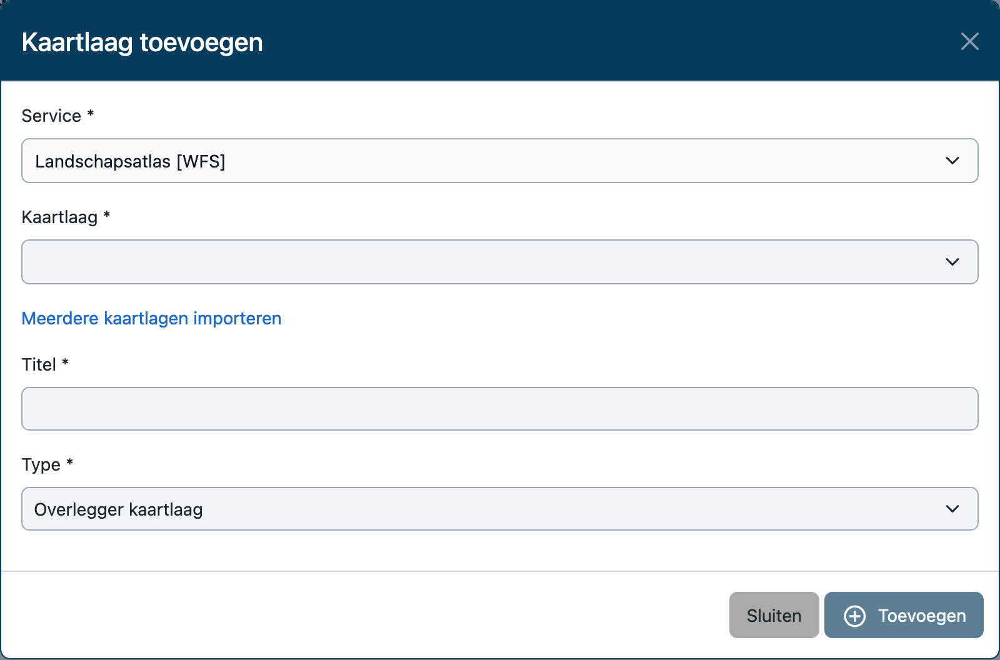

Een kaartlaag is een informatielaag, bestaande uit data die een gebruiker aan en uit kan zetten. MapGallery biedt de
mogelijkheid voor beheerders om eigen kaartlagen toe te voegen. Dit kunnen openbaar beschikbare kaartlagen zijn of
zelfgemaakte kaartlagen bestaande uit eigen geografische data. De kaartlagen kan de gebruiker onafhankelijk van elkaar
aan- en uitzetten. Afhankelijk van het protocol van de service waar de kaartlaag aan gekoppeld is, bestaat de
mogelijkheid gegroepeerde data in een kaartlaag aan of uit te zetten, te filteren of te stylen. Hierdoor wordt het
makkelijker om de data visueel te begrijpen.

Op de Kaartlagen pagina kun je instellingen beheren voor verschillende lagen binnen je kaarten, zoals de zichtbaarheid,
metadata en stijl van de {{ page.meta.vars.singular }}. Hieronder vind je een overzicht van de velden die je kunt
invullen, uitgelegd in een tabel.


2. Selecteer **Dashboard** uit het menu en ga naar de sectie **{{ page.meta.vars.plural }}**.


## Lijstweergave



| Naam           | Beschrijving                                                                               |
|----------------|--------------------------------------------------------------------------------------------|
| `Id`           | Uniek identificatienummer van de {{ page.meta.vars.singular }}.                            |
| `Datum`        | Datum waarop de {{ page.meta.vars.singular }} is toegevoegd of voor het laatst is bewerkt. |
| `Naam`         | De naam van de {{ page.meta.vars.singular }}.                                              |
| `Omschrijving` | Een korte uitleg over wat de {{ page.meta.vars.singular }} inhoudt.                        |
| `Ondergrond`   | Geeft aan of de {{ page.meta.vars.singular }} als ondergrond wordt gebruikt (Ja of Nee).   |

### Acties







### Context menu





## Bewerkingsscherm

Via het bewerkingsscherm worden alle relevante details van een **{{ page.meta.vars.singular }}** weergegeven en kunnen
kunnen de instellingen
worden gewijzingd.

### Bewerkingsopties

Bovenaan de pagina zijn de tabbladen [**Algemeen**](base) en [**Kaartlagen**](layers) voor verschillende instellingen
van de {{ page.meta.vars.singular }}.

#### Tabblad Algemeen

Bevat de belangrijkste instellingen van de {{ page.meta.vars.singular }} (zoals hieronder beschreven). Velden met een *
zijn verplicht. Uitleg van de Velden:

| Naam             | Beschrijving                                                                                                                                                            |
|------------------|-------------------------------------------------------------------------------------------------------------------------------------------------------------------------|
| `Uitschakelen`   | Een vinkvak waarmee je de kaartlaag kunt uitschakelen. Als dit is aangevinkt, wordt de laag niet gepubliceerd.                                                          |
| `Layer`          | De referentie naar de kaartlaag zoals vanuit de service gedefinieerd.                                                                                                   |
| `Titel`          | De naam van de {{ page.meta.vars.singular }}                                                                                                                            |
| `Notitie`        | Hier kunnen eventuele beheernotities worden toevoegen die niet zichtbaar zijn voor de eindgebruikers.                                                                   |
| `Omschrijving`   | Een beschrijving van de {{ page.meta.vars.singular }}. Deze omschrijving wordt gebruikt om gebruikers te informeren over de inhoud van de {{ page.meta.vars.singular }} |
| `Zoekwoorden`    | Voeg zoekwoorden toe om de kaartlaag beter vindbaar te maken. Gebruik tags zoals enkelvoudige of meervoudige termen.                                                    |
| `Classificatie`  | Gebruik dit veld om de kaartlaag in te delen binnen een bepaalde (hoofd)groep. Dit kan helpen bij het organiseren van lagen.                                            |
| `Type kaartlaag` | Selecteer het type kaartlaag, een overlegger of een ondergrond.                                                                                                         |
| `Transparantie`  | Stel hier de transparantie van de kaartlaag in.                                                                                                                         |
| `Niet weergeven` | Vink aan of de laag niet moet worden weergegeven in de legenda en/of in de locatie-informatie (bij kaartinformatie).                                                    |
| `Metadata URL`   | Voeg een URL toe waar gedetailleerde metadata over de kaartlaag kan worden gevonden. Deze URL wordt embedded weergegeven in de dialoog.                                 |
| `Metadata`       | Voer hier aanvullende metadata-informatie in. Dit kan platte tekst, HTML-opmaak of een link bevatten.                                                                   |

#### Tabblad Velden

Biedt de mogelijkheid om de attribuutinformatie van deze kaartlaag aan te passen. Je kunt hier de volgorde,
zichtbaarheid en namen van de velden wijzigen.

**Zichtbaarheid**: Als het selectievakje is aangevinkt, betekent dit dat het betreffende veld zichtbaar is in de
kaartinterface.

**Herordenen** van velden: Je kunt de volgorde van de velden aanpassen door op de drie verticale puntjes naast het veld
te
klikken en deze naar boven of beneden te slepen.

**Hernoemen** van velden: Je kunt de naam van de velden aanpassen door een andere waarden in te vullen.

#### Tabblad Interacties

N.t.b.

#### Tabblad Style

De Style tab geeft de mogelijkheid om de stijl van een kaartlaag te configureren. Dit omvat het aanpassen van visuele
eigenschappen zoals symbolen, kleuren, groottes, en andere weergaveopties.

**Legenda**: Aan de linkerkant van de pagina zie je de legenda die een overzicht geeft van de symbolen en stijlen die op
de
kaartlaag worden toegepast.

**JSON** configuratie: Aan de rechterkant van de pagina kun je de JSON-code zien die de stijl van de kaartlaag
definieert. De syntax die gebruikt wordt is gebaseerd op [GeoStyler](https://geostyler.org).

**Genereer style**: Hiermee kun je automatisch een standaardstijl genereren voor de kaartlaag, gebaseerd op de
attributen die in de laag aanwezig zijn. Dit is handig als je snel een eenvoudige weergave wilt maken.

**Extra**: Met deze knop kun je de stijl exporteren naar SLD of Mapbox, of een stijl vanuit SLD of Mapbox importeren.

### Acties









### Context menu

Via het uitklapmenu zijn de onderstaande opties beschikbaar.

 **Terug naar lijst**: Terug naar de lijst en de wijzigingen niet opslaan.

 **Verwijderen**: Door in het uitklapmenu te kiezen voor Verwijderen
kun je een {{ page.meta.vars.singular }} verwijderen.

## Een {{ page.meta.vars.singular }} toevoegen



### Kaartlaag selecteren

Het dialoogvenster voor het toevoegen van een {{ page.meta.vars.singular }} is interactief en geeft, op basis van de
gekozen service, suggesties voor de beschikbare kaartlagen.

Bij een WMS- of WFS-service kun je een kaartlaag selecteren uit een dropdownmenu. Via de link _Meerdere kaartlagen
importeren_ kun je bovendien meerdere kaartlagen selecteren uit een lijst. Dit gebeurt door middel van een
_GetCapabilities_-request.

Voor een TileJSON-service vult MapGallery de dropdown met beschikbare kaartlagen via een _catalog_-request, terwijl bij
HTTP- of GEOJSON-services de kaartlagen worden opgehaald via een JSON-bestand met een indexproperty.

Als het niet mogelijk is om de dropdown in te vullen, biedt MapGallery een vrij tekstveld aan waarin je de naam van de
kaartlaag handmatig kunt invoeren.

## Een {{ page.meta.vars.singular }} verwijderen

