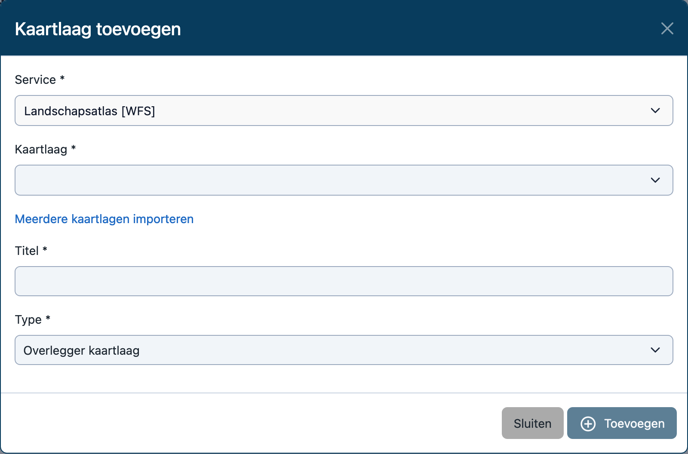

Een kaartlaag is een informatielaag, bestaande uit data die een gebruiker aan en uit kan zetten. MapGallery biedt de
mogelijkheid voor beheerders om eigen kaartlagen toe te voegen. Dit kunnen openbaar beschikbare kaartlagen zijn of
zelfgemaakte kaartlagen bestaande uit eigen geografische data. De kaartlagen kan de gebruiker onafhankelijk van elkaar
aan- en uitzetten. Afhankelijk van het protocol van de service waar de kaartlaag aan gekoppeld is, bestaat de
mogelijkheid gegroepeerde data in een kaartlaag aan of uit te zetten, te filteren of te stylen. Hierdoor wordt het
makkelijker om de data visueel te begrijpen.

Op de Kaartlagen pagina kun je instellingen beheren voor verschillende lagen binnen je kaarten, zoals de zichtbaarheid,
metadata en stijl van de {{ page.meta.vars.singular }}. Hieronder vind je een overzicht van de velden die je kunt
invullen, uitgelegd in een tabel.



2. Selecteer **Dashboard** uit het menu en ga naar de sectie **{{ page.meta.vars.plural }}**.
   

## Lijstweergave



| Naam         | Beschrijving                                                                               |
|--------------|--------------------------------------------------------------------------------------------|
| `Id`         | Uniek identificatienummer van de {{ page.meta.vars.singular }}.                            |
| `Datum`      | Datum waarop de {{ page.meta.vars.singular }} is toegevoegd of voor het laatst is bewerkt. |
| `Naam`       | De naam van de {{ page.meta.vars.singular }}.                                              |
| `Service`    | De service die wordt gebruik door de {{ page.meta.vars.singular }}.                        |
| `Protocol`   | Het protocol dat wordt gebruikt voor de {{ page.meta.vars.singular }}.                     |
| `Ondergrond` | Geeft aan of de {{ page.meta.vars.singular }} als ondergrond wordt gebruikt (Ja of Nee).   |

### Acties







### Context menu





## Bewerkingsscherm

Via het bewerkingsscherm worden alle relevante details van een **{{ page.meta.vars.singular }}** weergegeven en kunnen
de instellingen worden gewijzingd.

### Bewerkingsopties

Bovenaan de pagina zijn de tabbladen [**Algemeen**](#tabblad-algemeen), [**Velden**](#tabblad-velden), [**Interacties
**](#tabblad-interacties) en [**Style**](#tabblad-style) voor verschillende instellingen van de {{
page.meta.vars.singular }}.

#### Tabblad Algemeen

Bevat de belangrijkste instellingen van de {{ page.meta.vars.singular }} (zoals hieronder beschreven). Velden met een *
zijn verplicht. Uitleg van de Velden:

| Naam             | Beschrijving                                                                                                                                                            |
|------------------|-------------------------------------------------------------------------------------------------------------------------------------------------------------------------|
| `Uitschakelen`   | Een vinkvak waarmee je de kaartlaag kunt uitschakelen. Als dit is aangevinkt, wordt de laag niet gepubliceerd.                                                          |
| `Layer`          | De referentie naar de kaartlaag zoals vanuit de service gedefinieerd.                                                                                                   |
| `Titel`          | De naam van de {{ page.meta.vars.singular }}                                                                                                                            |
| `Notitie`        | Hier kunnen eventuele beheernotities worden toevoegen die niet zichtbaar zijn voor de eindgebruikers.                                                                   |
| `Omschrijving`   | Een beschrijving van de {{ page.meta.vars.singular }}. Deze omschrijving wordt gebruikt om gebruikers te informeren over de inhoud van de {{ page.meta.vars.singular }} |
| `Zoekwoorden`    | Voeg zoekwoorden toe om de kaartlaag beter vindbaar te maken. Gebruik tags zoals enkelvoudige of meervoudige termen.                                                    |
| `Classificatie`  | Gebruik dit veld om de kaartlaag in te delen binnen een bepaalde (hoofd)groep. Dit kan helpen bij het organiseren van lagen.                                            |
| `Type kaartlaag` | Selecteer het type kaartlaag, een overlegger of een ondergrond.                                                                                                         |
| `Transparantie`  | Stel hier de transparantie van de kaartlaag in.                                                                                                                         |
| `Niet weergeven` | Vink aan of de laag niet moet worden weergegeven in de legenda en/of in de locatie-informatie (bij kaartinformatie).                                                    |
| `Metadata URL`   | Voeg een URL toe waar gedetailleerde metadata over de kaartlaag kan worden gevonden. Deze URL wordt embedded weergegeven in de dialoog.                                 |
| `Metadata`       | Voer hier aanvullende metadata-informatie in. Dit kan platte tekst, HTML-opmaak of een link bevatten.                                                                   |

##### Kaartlaag groepen

Bij sommige protocollen zoals WMS en WFS is het toegestaan om meerdere kaartlagen als ```groep``` in één verzoek op te
halen. Dit heeft als voordeel dat meerdere layers als één MapGallery kaartlaag kunnen worden gepubliceerd.

Om dit te doen, klik hiervoor op de bewerk knop  en voer de kaartlaag namen in, gescheiden met
een komma.

#### Tabblad Velden

Biedt de mogelijkheid om de attribuutinformatie van deze kaartlaag aan te passen. Er zijn twee opties: velden en
template.

##### Velden

Je kunt hier de volgorde, zichtbaarheid en namen van de velden wijzigen.

**Zichtbaarheid**: Als het selectievakje is aangevinkt, betekent dit dat het betreffende veld zichtbaar is in de
kaartinterface.

**Herordenen** van velden: Je kunt de volgorde van de velden aanpassen door op de drie verticale puntjes naast het veld
te
klikken en deze naar boven of beneden te slepen.

**Hernoemen** van velden: Je kunt de naam van de velden aanpassen door een andere waarden in te vullen.

##### Template

Met de Template-functionaliteit kun je volledig zelf bepalen hoe attribuutinformatie van een kaartlaag wordt
weergegeven. In plaats van standaard velden te tonen, bouw je een eigen layout met HTML en dynamische veldwaarden.

###### Basisprincipe

Een template bestaat uit HTML waarin je veldwaarden injecteert met template literals:

```${veldnaam}```

Bijvoorbeeld:

```<p>Naam: <strong>${naam}</strong></p>```

Tijdens het renderen worden deze placeholders vervangen door de daadwerkelijke waarden van een feature.

Deel het template in met verschillende secties om de structuur en leesbaarheid te verbeteren. Denk hierbij aan een header
met de titel en identificatie, gevolgd door een overzicht met bijvoorbeeld scores en daarna detailsecties
met kenmerken per categorie. Voor de vormgeving kun je gebruikmaken van CSS classes, zoals [Bootstrap](https://getbootstrap.com), maar ook van
inline styles indien nodig. Daarnaast is het mogelijk om responsieve layouts toe te passen, bijvoorbeeld met flexbox of
grid, zodat de weergave zich goed aanpast aan verschillende schermformaten.

Voorbeeldstructuur:

```html
<header>
    <h1>${titel}</h1>
</header>

<section>
    <h2>Overzicht</h2>
    <p class="primary-text">${score}</p>
</section>
```

###### Voorbeelden

Via een expressie kan de uitvoer worden aangepast. Zie onderstaande voorbeelden.

De waarde van status tonen als die aanwezig is. Als het veld leeg is, wordt _Onbekend_ weergegeven.

```<p>Status: ${status ? status : 'Onbekend'}</p>```

Meerdere veldwaarden combineren in één regel:

```<p>${straat} ${huisnummer}, ${postcode} ${plaats}</p>```

Als een veld niet gevuld is, kun je een alternatieve tekst tonen:

```<p>Omschrijving: ${omschrijving || 'Geen omschrijving beschikbaar'}</p>```

Een klikbare link maken van een veld met een URL bevat:

```<a href="${url}" target="_blank">Open link</a>```

of:

```<a href="${url}" target="_blank">${url}</a>```

De tekst aanpassen op basis van een waarde:

```<p>Risiconiveau: ${score > 7 ? 'Hoog' : 'Normaal'}</p>```

Of een ja/nee-weergave maken:

```<p>Beschikbaar: ${actief ? 'Ja' : 'Nee'}</p>```

Voorwaardelijke styling, classes of inline styling dynamisch aanpassen. Hier wordt een badge met een andere kleur per status weergegeven:

```
<span class="badge ${status === 'Actief' ? 'bg-success' : 'bg-secondary'}">
  ${status}
</span>
```

Of met inline styling:
```
<span style="${score > 7 ? 'color:red;font-weight:bold;' : 'color:inherit;'}">
  ${score}
</span>
```

Numerieke waarden extra nadruk geven, bijvoorbeeld met een badge:

```<span class="badge bg-light text-dark border">${aantal}</span>```

Bij tekstvelden kleine bewerkingen doen, zoals hoofdletters:

```<p>Status: ${status ? status.toUpperCase() : '-'}</p>```

Of de eerste letter als hoofdletter tonen:

```<p>Categorie: ${categorie ? categorie.charAt(0).toUpperCase() + categorie.slice(1) : '-'}</p>```

Onderstaand voorbeeld combineert meerdere technieken:
```html
<div>
  <h3>${naam}</h3>
  <p>Categorie: ${categorie || 'Onbekend'}</p>
  <p>
    Score:
    <span class="badge bg-light text-dark border">
      ${score ?? '-'}
    </span>
  </p>
  <p>
    Status:
    <span class="badge ${status === 'Actief' ? 'bg-success' : 'bg-secondary'}">
      ${status || 'Onbekend'}
    </span>
  </p>
  <p>
    Bron:
    ${url ? `<a href="${url}" target="_blank">Open link</a>` : 'Geen link beschikbaar'}
  </p>
</div>
```

###### Opbouw van de interface

**HTML**-configuratie: Aan de linkerkant van de pagina kun je de HTML-code zien die de opmaak van de informatie
definieert.

**Preview**: Aan de rechterkant van de pagina zie je een preview die weergeeft hoe de template eruit ziet. Indien
mogelijk wordt de eerste
feature van de kaartlaag weergegeven als voorbeeld, anders komt hier de veldnaam in te staan.

**Genereer lijst of tabel**: Met deze functie kan er automatisch een standaard lijst of tabel gegenereerd worden als
template op basis van
de velden. Dit kan een goed begin zijn om verder op te bouwen

#### Tabblad WFS/WMS opties

##### WFS opties

Geeft de mogelijkheid om:

1. Te filteren op een numerieke attribuutwaarde met het “CQL filter”, zie voor meer informatie over CQL filters
   de [GeoServer documentatie](https://docs.geoserver.org/stable/en/user/tutorials/cql/cql_tutorial.html).

2. Symbolen of objecten alleen weergeven binnen een gewenst gebied dat overeenkomt met een bepaald zoomniveau

   Door een passende waarde in te vullen bij **Kaartweergave start zoomniveau** en het selectievakje **Gedeeltelijk
   WFS-verzoek** aan te
   vinken, kan de WFS-kaartlaag alleen objecten binnen de actieve kaartweergave opvragen. De richtwaarden voor
   zoomniveaus lopen van 1 voor de
   hele wereld tot 18 voor een huis, en deze optie is vooral handig bij zware kaartlagen.

**Let op:** opties 1 en 2 kunnen niet gecombineerd worden.

**Tip:** leeg de cache via Beheer als je problemen ervaart met filters.

##### WMS opties

Geeft de mogelijkheid om:

1. Te filteren op een numerieke attribuutwaarde met het “CQL filter” (zie WFS opties 1)

2. Te bepalen hoe kaartafbeeldingen door de server worden opgevraagd en weergegeven met de instelling “Image handling”

   **Single Image**: De kaart vraagt telkens één grote afbeelding op voor het volledige kaartgebied wanneer je in- of
   uitzoomt of de kaart
   verschuift. Deze methode is makkelijk te renderen en zorgt voor een naadloze weergave zonder zichtbare tegelranden.
   Bij grotere kaarten kan
   deze aanpak echter trager zijn, en het in- en uitzoomen kan merkbare laadtijd veroorzaken.

   **Tiled Images**: De kaart vraagt veel kleinere tegels op in plaats van één grote afbeelding. Deze methode zorgt voor
   sneller laden, omdat
   alleen de tegels die veranderen bij het in- of uitzoomen opnieuw hoeven te worden opgevraagd.
   Een nadeel is dat tijdens het laden licht zichtbare tegelranden kunnen optreden.

3. Ook de "Style" (default of SLD) en het "Legenda type " kunnen worden geselecteerd.

#### Tabblad Interacties

**Animatie**

Voor het animeren van data kunnen verschillende parameters worden ingesteld:

* _Veldnaam_: Het veld dat wordt gebruikt voor de animatie.
* _Vergelijking_ + _waarde_: Bepaalt welke data zichtbaar is. Het is mogelijk om alleen symbolen weer te geven die
  gelijk
  zijn aan een specifieke
  waarde (`== ${value}`), of om cumulatieve data te tonen waarbij de dataset zich geleidelijk uitbreidt (`<= ${value}`).
* _Startwaarde_ + _stapgrootte_: De waarde waarmee de animatie start en de grootte van de stappen waarin de data wordt
  doorlopen.
* _Omit_: Een getal dat wordt overgeslagen tijdens de animatie.
* _Minimale_ en _maximale_ waarde: Het bereik van de animatie; de begin- en eindwaarde.

Let op: animatie is uitsluitend mogelijk met numerieke data. Niet-numerieke waarden worden niet ondersteund.

**Hoogte**

De instellingen voor hoogte komen overeen met die van animatie. In plaats van een bewegende animatie resulteert dit
echter in een schakelknop waarmee tussen verschillende hoogtes of verdiepingen kan worden gewisseld.

**Verversen**

Het veld Verversen bepaalt in seconden hoe vaak de data opnieuw wordt opgehaald bij de service.

#### Tabblad Style

De Style tab geeft de mogelijkheid om de stijl van een kaartlaag te configureren. Dit omvat het aanpassen van visuele
eigenschappen zoals symbolen, kleuren, groottes, en andere weergaveopties. Zie voor meer informatie over de
stijlmogelijkheden [Tabblad Style](./layer-style.md).

**JSON** configuratie: Aan de linker van de pagina is de JSON-code zien die de stijl van de kaartlaag
definieert. De syntax die gebruikt wordt is gebaseerd op [GeoStyler](https://geostyler.org).

**Legenda**: Aan de rechterkant van de pagina zie je de legenda die een overzicht geeft van de symbolen en stijlen die
op
de kaartlaag worden toegepast.

**Genereer style**: Met deze functie kun je automatisch een standaardstijl genereren voor een kaartlaag, gebaseerd op de
attributen die in de laag aanwezig zijn. Dit is vooral handig wanneer je snel een eenvoudige, maar duidelijke weergave
van de data wilt maken. Zie ook: [MapGallery GeoStyler kookboek](https://geostyler.mapgallery.eu).

Bij het aanmaken van een stijl zijn er verschillende instellingen en keuzes beschikbaar:

##### Kies het juiste geometrietype

Bepaal eerst het type geometrie van de kaartlaag: punt, lijn of vlak. Dit is essentieel, omdat elke geometrie specifieke
stylingopties heeft.

##### Styling voor punten

Je kunt kiezen tussen eenvoudige symbolen of een afbeelding (via een hyperlink). De eenvoudige symbolen kunnen worden
aangegeven door middel
van de WellKnownMarks van geostyler. De opties zijn: `circle`, `square`, `triangle`, `star`, `cross` en `x`.

Als je geen afbeelding gebruikt en geen categoriegebaseerde weergave wilt, kun je de kleur van het symbool instellen om
de punten monochroom weer te geven.

##### Weergave op categorie

Kies “Weergave op categorie” wanneer je verschillende symbolen of kleuren wilt gebruiken voor meerdere categorieën
binnen de kaartlaag. Selecteer vervolgens het attribuutveld dat gebruikt moet worden voor de categorisatie. De stijl (
zoals vulling, randkleur, symbooltype, enzovoort) wordt automatisch gegenereerd voor elke categorie. Indien gewenst kun
je de automatisch aangemaakte stijlen handmatig aanpassen in het codeveld.

##### Labels weergeven

Activeer “Labels tonen” om tekstlabels aan de kaart toe te voegen. Kies het veld dat als labeltekst moet worden
weergegeven. Labels hebben hun eigen reeks stylingopties (zoals lettertype, grootte, kleur en plaatsing). Voor meer
informatie over labelopties, zie ook [MapGallery GeoStyler kookboek](https://geostyler.mapgallery.eu).

**Extra**: Met deze knop kun je de stijl exporteren naar SLD of Mapbox, of een stijl vanuit SLD of Mapbox importeren.

### Acties









### Context menu

Via het uitklapmenu zijn de onderstaande opties beschikbaar.

 **Terug naar lijst**: Terug naar de lijst en de wijzigingen niet opslaan.

 **Verwijderen**: Door in het uitklapmenu te kiezen voor Verwijderen
kun je een {{ page.meta.vars.singular }} verwijderen.

## Een {{ page.meta.vars.singular }} toevoegen



### Kaartlaag selecteren

Het dialoogvenster voor het toevoegen van een {{ page.meta.vars.singular }} is interactief en geeft, op basis van de
gekozen service, suggesties voor de beschikbare kaartlagen.



Bij een WMS- of WFS-service kun je een kaartlaag selecteren uit een dropdownmenu. Via de link _Meerdere kaartlagen
importeren_ kun je bovendien meerdere kaartlagen selecteren uit een lijst. Dit gebeurt door middel van een
_GetCapabilities_-request.

Voor een TileJSON-service vult MapGallery de dropdown met beschikbare kaartlagen via een _catalog_-request, terwijl bij
HTTP- of GEOJSON-services de kaartlagen worden opgehaald via een JSON-bestand met een indexproperty.

Als het niet mogelijk is om de dropdown in te vullen, biedt MapGallery een vrij tekstveld aan waarin je de naam van de
kaartlaag handmatig kunt invoeren.

## Een {{ page.meta.vars.singular }} verwijderen

