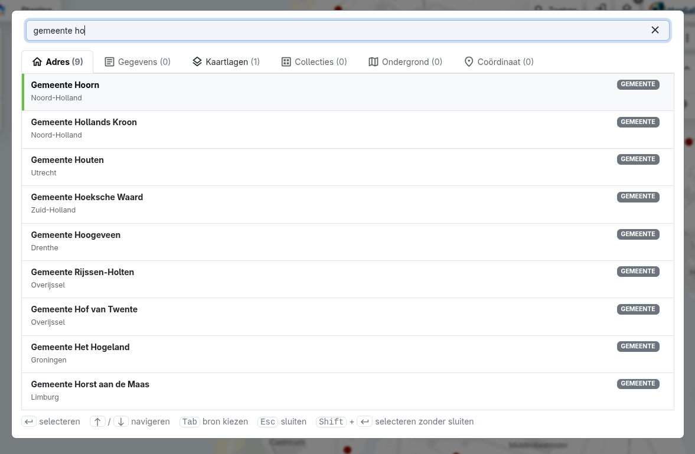

# MapGallery 8 – Release notes

### 8.0 <small>oktober 2026</small>

MapGallery 8 is de grootste vernieuwing van MapGallery tot nu toe. De kaart krijgt het volledige scherm, zoeken gebeurt vanuit één centraal venster en je kunt veel meer met de gegevens op de kaart: objecten in een gebied selecteren, als tabel bekijken en downloaden in het formaat dat je nodig hebt. Daarnaast zijn meten en tekenen flink uitgebreid en kun je je eigen bestanden op de kaart zetten.

---

## Vernieuwde interface

De vaste kopbalk is verdwenen. Alle bediening zweeft nu boven de kaart, zodat er meer ruimte overblijft voor waar het om draait.

- **Zijbalk met gereedschappen** links: Locatie-informatie, Ondergrond, Meten & Tekenen, Collecties en Favorieten.
- **Zoeken, Kaartlagen en het MapGallery-menu** staan rechtsboven. Een teller op de kaartlagenknop laat zien hoeveel lagen er actief zijn.
- **De legenda** is compacter. Hij kan worden ingeklapt, de knoppen per laag staan onderaan en minder gebruikte acties zitten in een extra menu. Bij lagen met een tijdsanimatie staat de animatie nu prominent in de titel.
- **Gereedschapsvensters** openen met een animatie, je kunt hun breedte aanpassen en die breedte wordt onthouden. De kaart blijft eronder klikbaar.
- **Donkere modus** wordt in de hele applicatie ondersteund, ook voor het logo.
- **Betere mobiele ondersteuning**: de kaartbediening, gereedschapsvensters en legenda zijn aangepast aan kleine schermen.
- Vernieuwde schermen voor inloggen en registreren, en een overzichtelijker hoofdmenu.

| Versie 7 | Versie 8 |
|---|---|
|  |  |

## Direct naar de kaart, met populaire collecties

Het aparte overzicht om collecties te verkennen is vervallen. Je komt direct op de kaart terecht. Als er nog geen collectie is gekozen, zie je de **populaire en recent gebruikte collecties**, en via _Meer collecties weergeven_ zoek je door alle collecties.

- Je verlaat een collectie of wisselt van collectie zonder de kaart te verlaten.
- Bij het wisselen van collectie past de ondergrond zich automatisch aan.

## Eén zoekvenster voor alles

Er is één groot zoekvenster dat je opent met de knop **Zoeken** rechtsboven of met **Ctrl/Cmd + K**. Daarin doorzoek je alles tegelijk.

- Er zijn tabbladen voor **Adres, Gegevens, Kaartlagen, Collecties, Ondergrond en Coördinaat**, elk met het aantal resultaten.
- Resultaten zijn rijker: een label voor het soort resultaat (weg, adres, postcode, WFS, WMTS, …), thema-tags, de bron en een korte beschrijving.
- Je bedient het volledig met het toetsenbord: met de pijltjes navigeer je, **Tab** kiest een bron en **Shift + Enter** voegt een kaartlaag toe zonder dat het venster sluit. Zo voeg je snel meerdere lagen toe.
- Lege tabbladen worden gedimd en het venster springt automatisch naar een tabblad met resultaten.

## Locatie-informatie

Wie op de kaart klikt, krijgt meer informatie, overzichtelijk gepresenteerd.

- Een **adresblok** toont de coördinaat (met coördinatenstelsel), buurt, wijk, gemeente en woonplaats.
- Bij meerdere objecten op dezelfde plek **blader je met pijltjes** door de resultaten (bijv. 1 / 5).
- **Afbeeldingen** in de gegevens worden direct in de attributentabel getoond.
- **Statistieken** (grafieken over de geselecteerde objecten) zijn naar dit paneel verplaatst.

| Versie 7 | Versie 8 |
|---|---|
|  |  |

## Objecten selecteren in een gebied

Je kunt nu veel meer objecten tegelijk selecteren:

- **Selecteren op gebied:** kies in het adresblok buurt, wijk, gemeente of woonplaats en alle objecten binnen die grens worden geselecteerd. De grenzen sluiten nu precies aan op de werkelijke grenzen.
- **Selecteren met een rechthoek:** houd **Shift** ingedrukt en sleep een rechthoek over de kaart.
- **Selecteren over meerdere lagen**, elk met een eigen kleur. Objecten die niet actief zijn worden grijs weergegeven.
- Selecteren in grote gebieden is aanzienlijk sneller. De selectie wordt eerst getekend en daarna gevuld.
- Als je een laag uitzet, verdwijnt ook de selectie van die laag.

| Selectie op gemeente | Selectie met rechthoek |
|---|---|
|  |  |

## Downloaden

Het downloadvenster is volledig vernieuwd:

- Formaten: **GeoPackage, Shapefile (zip), GeoJSON, CSV, Excel en DXF**, elk met een korte uitleg wanneer je het gebruikt.
- Je kiest zelf de **projectie**, bijvoorbeeld het Rijksdriehoekstelsel (EPSG:28992).
- Het downloaden werkt ook voor **selecties en actieve filters**.

## Meten & Tekenen

Het teken- en meetgereedschap is grotendeels opnieuw opgezet.

- Alle getekende objecten staan in een **lijst**. Je kunt ze **slepen om de volgorde te wijzigen**, tonen of verbergen, erop inzoomen, hernoemen of verwijderen.
- Objecten krijgen een **label op de kaart** met nummer en maat.
- **Eenheden zijn instelbaar:** voor afstand meter, kilometer, mijl of zeemijl en voor oppervlakte m², km², mi² of hectare.
- Je kiest het **coördinatenstelsel** waarin punten worden weergegeven.
- **Zoekresultaten, adressen en geselecteerde objecten** voeg je met één klik aan je tekening toe. De kaart zoomt er dan naartoe.
- Tekeningen, labels en afstanden worden meegenomen in de **kaartexport** en zijn ook los te exporteren.

| Tekenlijst | Eenheden instellen |
|---|---|
|  |  |

## Eigen bestanden op de kaart

Met **Lokaal bestand importeren** zet je je eigen gegevens tijdelijk op de kaart.

- Je sleept een bestand naar het venster of bladert ernaar. Ondersteunde formaten zijn **CSV, Shapefile (zip), GeoJSON, KML, GeoPackage, GPX en GML**.
- Bestanden met meerdere lagen (bijv. een GPX-bestand met waypoints, tracks en trackpunten) kies je per laag, elk met een eigen kleur.
- De projectie wordt automatisch herkend en kan worden aangepast.
- Het bestand wordt **alleen op je eigen apparaat verwerkt** en niet opgeslagen op de server.

## Voor beheerders

- Met een knop **WFS-capabilities** stel je WFS-lagen eenvoudiger in.
- Vanuit een collectie ga je **direct naar het beheer** ervan.
- De beheeromgeving werkt beter op kleine schermen.
- Statistieken kun je ook bij grote aantallen als CSV downloaden.

## Onder de motorkap

- Bijgewerkt naar **Angular 22** en actuele bibliotheken.
- **Kaartlagen laden sneller en stabieler** dankzij verbeterde caching en het ophalen van gegevens op de achtergrond.
- De **proxy** voor externe kaartdiensten is opnieuw opgebouwd. Hij is stabieler bij veel verkeer en veiliger: inloggegevens van diensten gaan alleen naar de juiste server.
- **Automatische foutregistratie** helpt ons problemen op te sporen voordat je ze meldt.
