# MapGallery 8 – Release notes

### 8.0 <small>oktober 2026</small>

MapGallery 8 is de grootste vernieuwing van MapGallery tot nu toe. De kaart krijgt het volledige scherm, zoeken gebeurt vanuit één centraal
venster en je kunt veel meer met de gegevens op de kaart. Selecteer objecten in een gebied, bekijk ze als tabel en download ze in het
gewenste formaat. Ook kun je eigen lokale bestanden direct openen en op de kaart zetten. Daarnaast zijn Meten & Tekenen flink uitgebreid.

---

## Vernieuwde interface

De vaste bovenbalk is verdwenen. Alle bediening is geïntegreerd met de kaart, zodat er meer ruimte overblijft voor waar het om draait.

- **Zijbalk met gereedschappen** links: alle gereedschappen Locatie-informatie, Ondergrond, Meten & Tekenen, Collecties en Favorieten staan
  overzichtelijk in de zijbalk.
- **Zoeken, Kaartlagen en het Hoofdmenu** staan rechtsboven en geven een vaste en herkenbare plek in de applicatie.
- **De legenda** is compacter. Hij kan worden ingeklapt, de knoppen per laag staan onderaan en minder gebruikte acties zitten in een extra
  menu.
- **Gereedschapsvensters** hebben minder witruimte, overlappen de kaart zo min mogelijk en zijn aanpasbaar in de breedte.
- **Donkere modus** wordt in de hele applicatie ondersteund.
- **Vernieuwde schermen** voor metadata, downloaden, inloggen en registreren, en een overzichtelijker hoofdmenu.

| Versie 7                                | Versie 8                                           |
|-----------------------------------------|----------------------------------------------------|
| 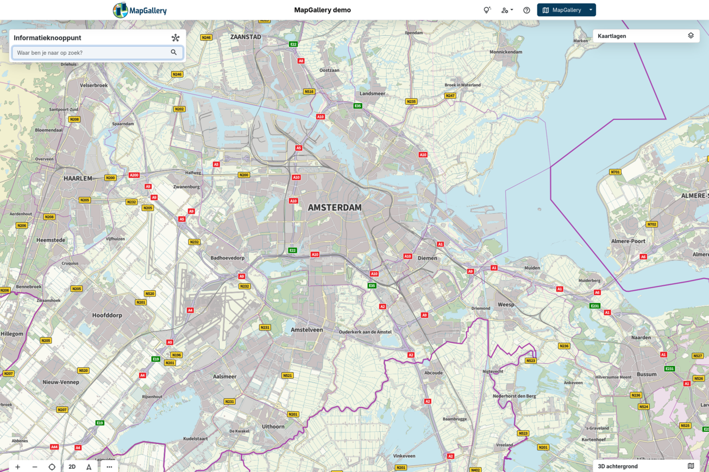 | 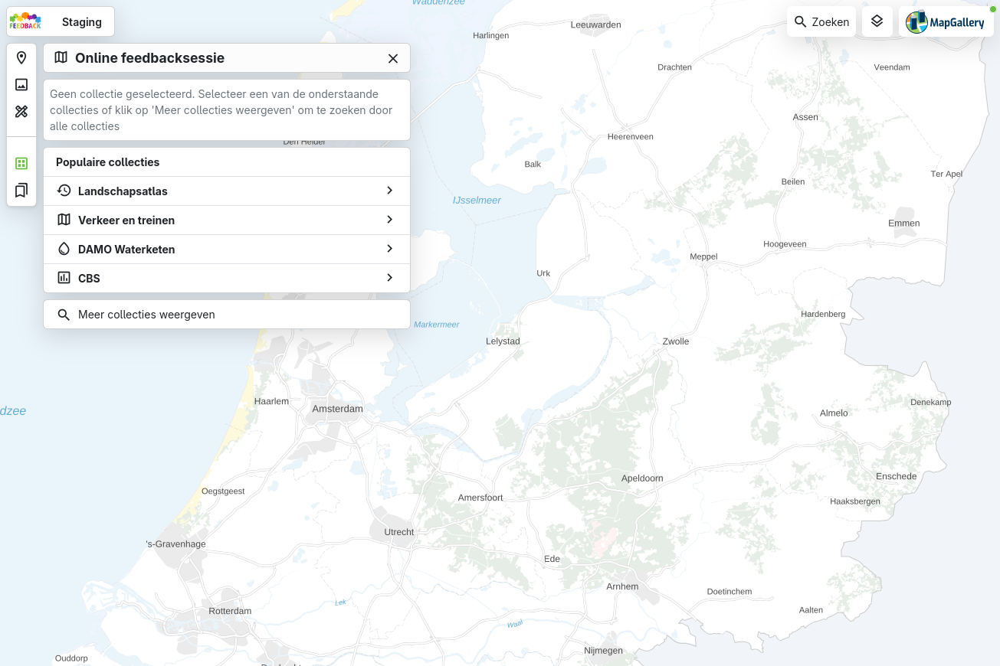 |

## Direct naar de kaart, met populaire collecties

Het aparte overzicht om collecties te verkennen is vervallen. Als er geen collectie is gekozen, kom je direct op de kaart terecht en zie je
de **populaire en recent gebruikte** collecties. Via _Meer collecties weergeven_ zoek je door alle collecties.

- Bestaande collecties uit versie 7 blijven werken en hoeven niet aangepast te worden. Voor de overstap naar versie 8 is geen actie van
  beheerders nodig.
- De collecties zijn doorzoekbaar en de classificaties worden ook weergegeven.
- Je verlaat een collectie of wisselt van collectie zonder de kaart te verlaten.
- Bij het wisselen van collectie past de ondergrond zich automatisch aan.

## Eén centraal zoekvenster

Er is één centraal zoekvenster dat je opent met de knop **Zoeken** rechtsboven of met **Ctrl/Cmd + K**. Daarin doorzoek je alles tegelijk.

- De resultaten worden overzichtelijk getoond in aparte tabbladen voor **Adres, Gegevens, Kaartlagen, Collecties, Ondergrond en
  Coördinaat**, elk met het aantal resultaten.
- Resultaten zijn rijker: een label voor het soort resultaat (weg, adres, postcode, WFS, WMTS, …), thema-tags, de bron en een korte
  beschrijving.
- Je bedient het volledig met het toetsenbord: met de pijltjes navigeer je, **Tab** kiest een bron en **Shift + Enter** voegt een kaartlaag
  toe zonder dat het venster sluit. Zo voeg je snel meerdere lagen toe.
- Lege tabbladen worden gedimd en het venster springt automatisch naar een tabblad met resultaten.

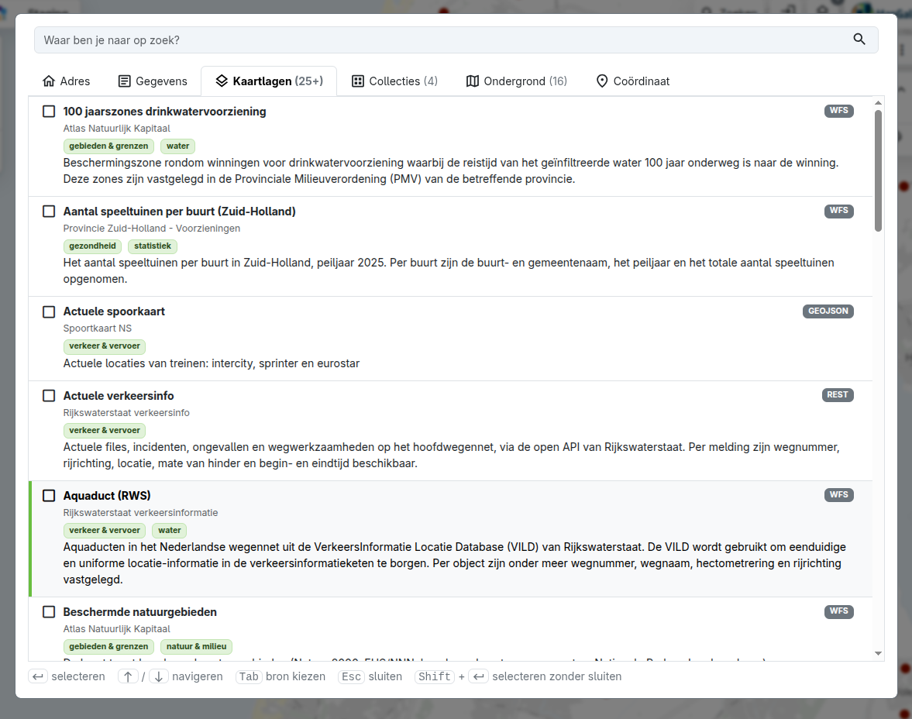

## Locatie-informatie

Wie op de kaart klikt, krijgt direct meer informatie, overzichtelijk gepresenteerd.

- Een **adresblok** toont het coördinaat (met coördinatenstelsel), maar ook het adres, de buurt, wijk, gemeente en woonplaats.
- Wissel eenvoudig tussen buurt, wijk, gemeente en woonplaats om het bijbehorende gebied op de kaart te zien en objecten binnen dat gebied
  te selecteren.
- Selecteer meerdere objecten door **Shift ingedrukt te houden** en een rechthoek over de kaart te slepen.
- Bij meerdere geselecteerde objecten **blader je door de resultaten** (bijvoorbeeld 1 / 5).
- **Statistieken** over de geselecteerde objecten zijn naar dit paneel verplaatst.
- Ook de **tabelweergave** vind je nu in dit paneel.

| Versie 7                                                      | Versie 8                                                      |
|---------------------------------------------------------------|---------------------------------------------------------------|
| 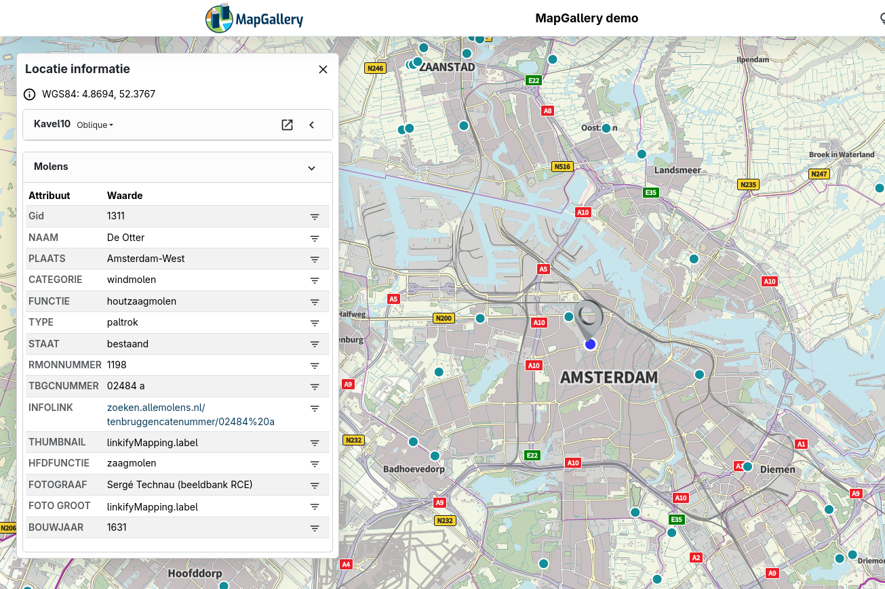 | 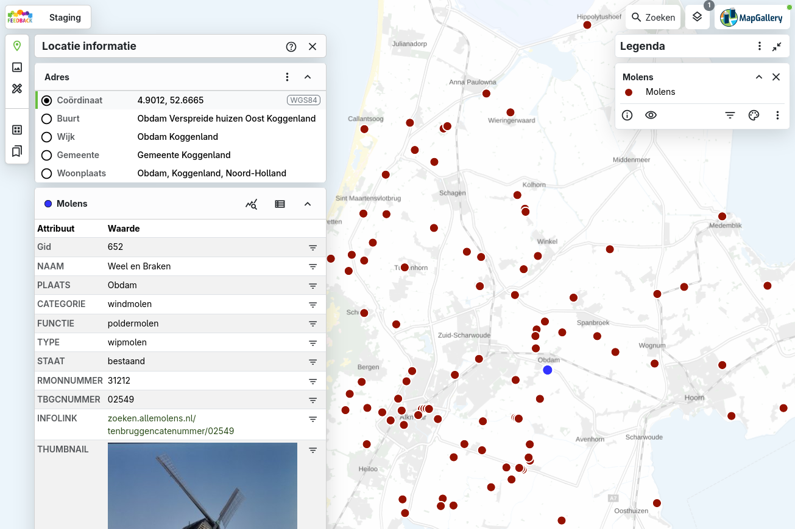 |

## Objecten selecteren in een gebied

Je kunt nu veel meer objecten tegelijk selecteren:

- **Selecteren op gebied:** kies in het adresblok buurt, wijk, gemeente of woonplaats en alle objecten binnen die grens worden geselecteerd.
  Het selectiegebied volgt daarbij de grens van de gekozen buurt, wijk, gemeente of woonplaats.
- **Selecteren met een rechthoek:** houd **Shift** ingedrukt en sleep een rechthoek over de kaart.
- **Selecteren over meerdere lagen**, elk met een eigen kleur. Objecten die niet actief zijn worden grijs weergegeven.
- Exporteer het resultaat van je selectie als **GeoPackage, Shapefile (zip), GeoJSON, CSV, Excel of DXF**.
- Selecteren in grote gebieden is aanzienlijk sneller. De selectie wordt eerst getekend en daarna gevuld.

| Selectie op gemeente                                  | Selectie met rechthoek                                   |
|-------------------------------------------------------|----------------------------------------------------------|
| 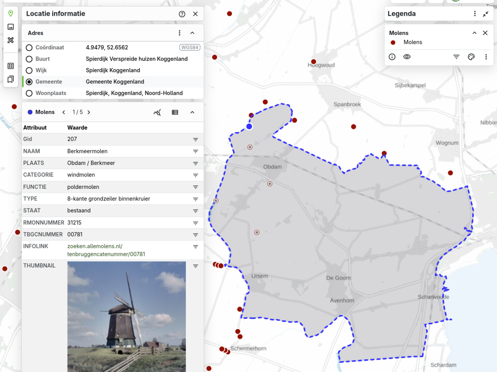 | 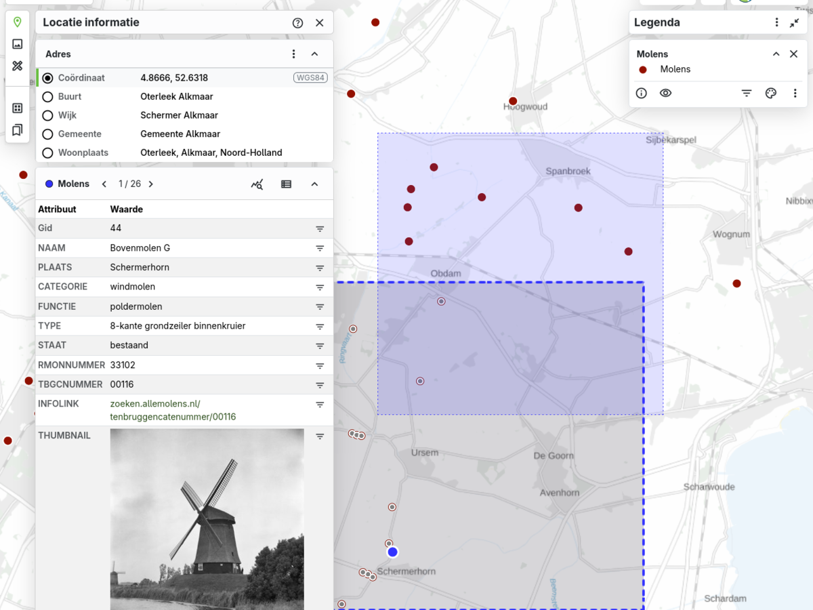 |

## Downloaden

Het downloadvenster is volledig vernieuwd:

- Formaten: **GeoPackage, Shapefile (zip), GeoJSON, CSV, Excel en DXF**, elk met een korte uitleg wanneer je het gebruikt.
- Je kiest zelf de **projectie**, bijvoorbeeld het Rijksdriehoekstelsel (EPSG:28992).
- Het downloaden werkt ook voor **selecties en actieve filters**.

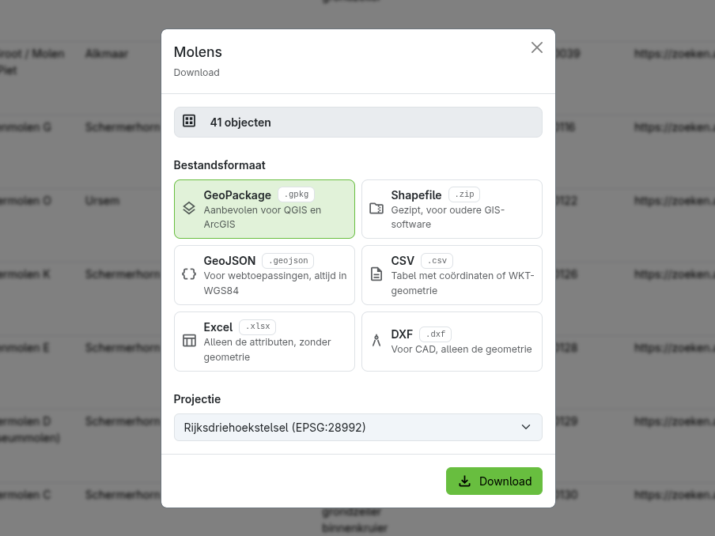

## Meten & Tekenen

Het teken- en meetgereedschap is grotendeels opnieuw opgezet.

- Alle getekende objecten staan in een **lijst**. Je kunt ze **verslepen om de volgorde te wijzigen**, tonen of verbergen, erop inzoomen,
  hernoemen of verwijderen.
- Getekende **objecten** blijven lokaal bewaard, ook nadat je het gereedschap of MapGallery hebt gesloten.
- Objecten krijgen een label op de kaart met nummer en maat.
- **Eenheden zijn instelbaar**: voor afstand meter, kilometer, mijl of zeemijl; voor oppervlakte m², km², mi² of hectare.
- De **buffertool** is geïntegreerd in Meten & Tekenen.
- Getekende gebieden kun je als **invoer gebruiken voor Locatie-informatie**.
- Tekeningen, labels en afstanden worden meegenomen in de **kaartexport**.

| Tekenlijst                                   | Eenheden instellen               |
|----------------------------------------------|----------------------------------|
| 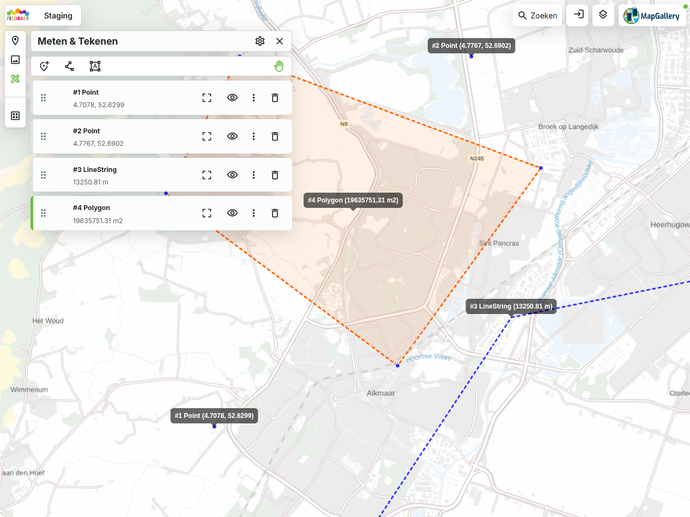 | 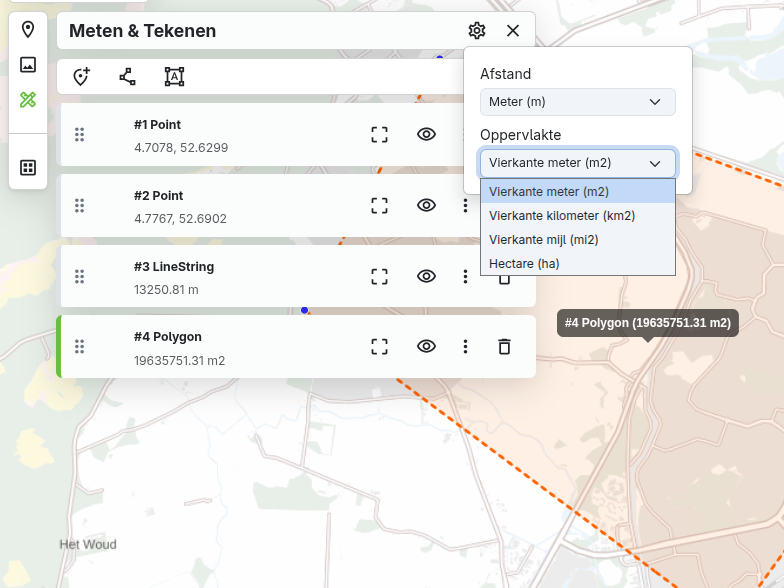 |

## Eigen bestanden op de kaart

Met **Lokaal bestand importeren** zet je eigen gegevens tijdelijk op de kaart. Je vindt deze functie via _Kaartlagen_ → _Lokaal bestand
toevoegen_. Dit is handig als je snel een GIS-bestand wilt bekijken zonder het eerst te publiceren of aanvullende GIS-software te gebruiken.

- Ondersteunde formaten zijn **CSV, Shapefile (zip), GeoJSON, KML, GeoPackage, GPX en GML**.
- Bij bestanden met meerdere lagen, zoals een GPX-bestand met waypoints, tracks en trackpunten, kies je zelf welke lagen je importeert.
  Iedere laag krijgt een eigen kleur.
- De projectie wordt automatisch herkend en kan worden aangepast.
- Het bestand wordt **alleen op je eigen apparaat verwerkt** en niet opgeslagen op de server.

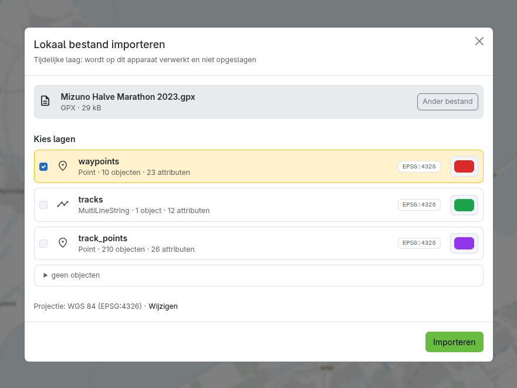

## Voor beheerders

Voor de overstap naar versie 8 is geen actie nodig. Bestaande collecties en instellingen blijven werken.
- De knop **WFS-capabilities** helpt bij het configureren van WFS-lagen.
- Vanuit de metadata van een kaartlaag ga je direct naar het bijbehorende onderdeel in de **beheeromgeving**.
- Statistieken kun je ook bij grote aantallen als **CSV downloaden**.
- De beheeromgeving is beter bruikbaar op kleinere schermen.

## Onder de motorkap

- Bijgewerkt naar **Angular 22** en actuele bibliotheken.
- **Kaartlagen laden sneller en stabieler** dankzij verbeterde caching en het ophalen van gegevens op de achtergrond.
- De **proxy** voor externe kaartdiensten is opnieuw opgebouwd en daardoor stabieler en veiliger.
- **Automatische foutregistratie** helpt ons problemen sneller op te sporen, soms al voordat ze worden gemeld.
