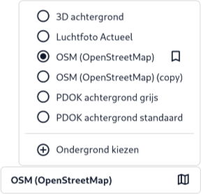

De optie rechtsonder bij [Ondergronden (F)](../map/#f-ondergronden) biedt de mogelijkheid om de ondergrondkaart te
kiezen die als basislaag wordt gebruikt in de kaartweergave. De ondergrondkaart fungeert als visuele basis waarop andere
kaartlagen worden geplaatst. Hieronder vind je een uitleg van de beschikbare opties.

Door een ondergrondkaart te selecteren, bepaal je de basisweergave van de kaart waarop andere lagen worden
geprojecteerd. Je kunt op elk moment terugkeren naar dit menu om de ondergrondkaart aan te passen op basis van je
behoeften en analyses.

### Opties

De kaartlagen in de dropdown zijn door de beheerder aangemerkt als standaardondergronden en worden als beschikbare
opties weergegeven. De actieve ondergrond is gemarkeerd met een bolletje. Door op een andere ondergrond in de lijst te
klikken, wissel je de actieve basislaag.

### Functies

**Ondergrond kiezen**: Gebruik deze optie om alle beschikbare ondergrondkaarten te bekijken. Dit opent een pop-upvenster met
een volledige lijst van alle beschikbare ondergronden.

**Favoriet**: Markeer een ondergrondkaart als favoriet, zodat je deze snel opnieuw kunt selecteren zonder door de volledige
lijst te hoeven bladeren.