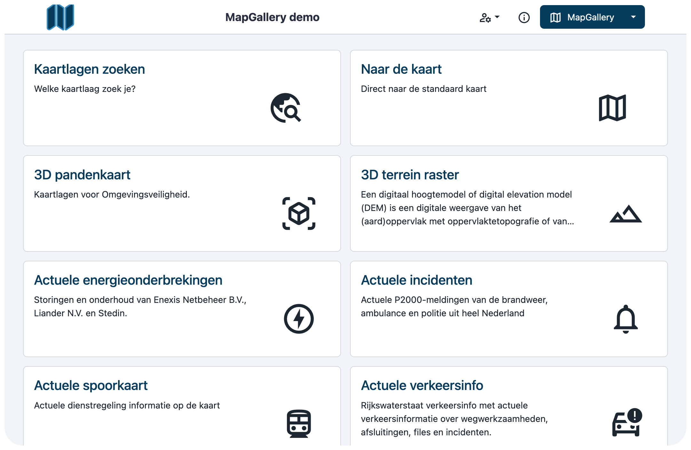

De startpagina van MapGallery biedt een overzicht van alle beschikbare collecties. Hieronder vind je uitleg over de
verschillende elementen en opties op deze pagina.



2. Kies **Collecties** uit het menu.

## Collecties

Een collectie bestaat uit één of meer kaartlagen die een thematische kaart vormen, gericht op een specifiek onderwerp.
Het doel van een collectie is om gebruikers eenvoudig toegang te bieden tot actuele thema's en kaartlagen. Gebruikers
kunnen via deze collecties gemakkelijker de juiste geografische data-visualisaties vinden. Beheerders kunnen bovendien
zelfgemaakte collecties beheren en gebruikers toegang verlenen tot deze collecties.

Op de Collectie-pagina worden alle collecties waar een gebruiker toegang toe heeft weergegeven in een raster (grid). De
eerste tegel, **Kaartlagen zoeken** (linksboven in het grid), is altijd beschikbaar, ongeacht het ingelogde account.
Deze tegel biedt de mogelijkheid om specifieke kaartlagen te zoeken. De tweede tegel, **Naar de kaart**, verwijst naar
de standaardkaart. Deze tegel is altijd aanwezig, net als de zoektegel.

Door op een collectie te klikken, word je naar de kaart geleid, waar de kaart inclusief de kaartlagen van die collectie
zichtbaar zijn.

### Standaard tegel

Elke tegel op de startpagina staat voor een collectie die je kunt openen door erop te klikken. De eerste twee tegels
zijn altijd beschikbaar en geven een snelle ingang naar een ander onderdeel van de applicatie.

**Kaartlagen zoeken**: Met deze optie kun je uitgebreid zoeken naar een specifieke kaartlaag. Dit is handig als je weet
welke kaartlaag je nodig hebt, maar niet direct weet waar deze zich bevindt in het systeem.

**Naar de kaart**: Hiermee kun je direct naar de standaardkaart gaan. Dit is vaak een overzichtskaart die een algemeen
beeld geeft van de beschikbare gegevens.
