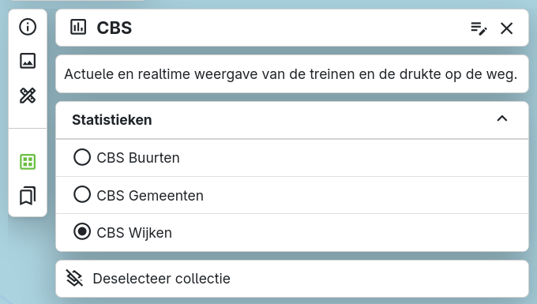

In het menu linksboven kun je met de tweede knop van onderen () zien welke collectie momenteel geopend is en zoeken naar andere beschikbare collecties. 

## Collecties

Een collectie bestaat uit één of meer kaartlagen die samen een thematische kaart vormen, gericht op een specifiek onderwerp.

Het doel van een collectie is om gebruikers eenvoudig toegang te bieden tot actuele thema's en bijbehorende kaartlagen. Via deze collecties kunnen gebruikers gemakkelijker de juiste geografische data en visualisaties vinden. Beheerders kunnen daarnaast zelfgemaakte collecties beheren en gebruikers toegang geven tot deze collecties.

Door in het menu linksboven op het collectie-icoon() te klikken, kun je zien welke collectie momenteel op de kaart geopend is. Een collectie bestaat uit een titel, een icoon en een omschrijving. Daaronder worden de kaartlagen van de collectie weergegeven. Deze kunnen worden gestructureerd in verschillende groepen.

De kaartlagen binnen een collectie of groep kunnen twee soorten knoppen hebben:

* **Checkbox**: hiermee kun je een kaartlaag aan- of uitzetten.
* **Radio button**: hiermee kun je wisselen tussen kaartlagen. Dit maakt het mogelijk om binnen een groep slechts één kaartlaag tegelijk te tonen. Wanneer je een nieuwe laag uit de groep selecteert, wordt de eerder actieve laag automatisch uitgeschakeld.

Helemaal onderaan kun je de gehele collectie deselecteren. Hiermee wordt de volledige collectie gesloten.

Als er nog geen collectie geopend is, kun je naar een beschikbare collectie zoeken. Je wordt dan direct naar het zoekvenster geleid, waar je naar beschikbare collecties kunt zoeken. Door op een collectie te klikken, wordt deze aan de kaart toegevoegd.