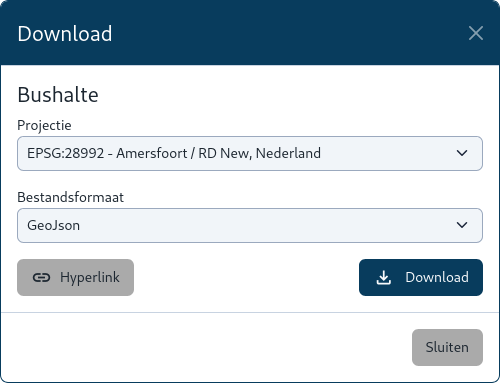
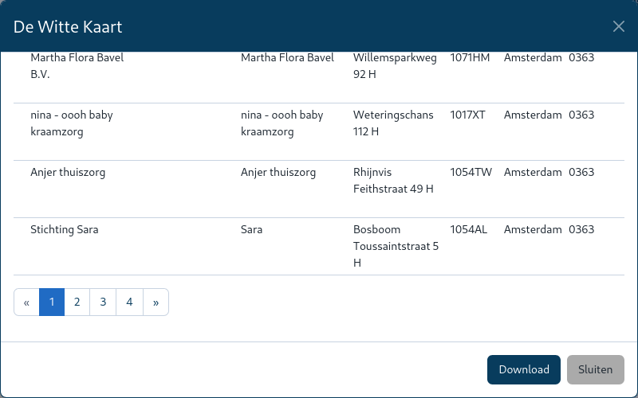

Er zijn verschillende manieren om gegeven te exporteren uit MapGallery.

## Exporteer Kaartbeeld

De opties onder **Export** bij [Tools (E)](../../map/#kaartviewer) bieden de mogelijkheid om de
huidige kaartweergave op te slaan of te delen. Beide opties maken het mogelijk om eenvoudig de resultaten van je
kaartwerk te bewaren of te delen. Hier zijn de beschrijvingen van de twee exportopties:

1. Zorg ervoor dat de [**Kaartviewer**](../map) actief is. 

1. Klik bij [Tools (E)](../map/#e-kaartnavigatie-tools) op het uitklapmenu () en kies vervolgens
   een van de volgende opties:

#### Kaartbeeld als afbeelding

Met deze optie kun je de huidige weergave van de kaart opslaan als een afbeelding in PNG-formaat. Dit is handig voor het
maken van
visuele rapporten of presentaties waarin een momentopname van de kaart nodig is. De afbeelding wordt gegenereerd op
basis van het huidige kaartbeeld, inclusief alle zichtbare kaartlagen en annotaties.

#### Link naar huidige kaartbeeld

Deze optie genereert een directe link of permalink naar het huidige kaartbeeld, inclusief de positie en zoomniveau van
de kaart. Deze link kan worden gedeeld met anderen, zodat zij dezelfde kaartweergave kunnen bekijken. Dit is nuttig voor
het eenvoudig
delen van specifieke kaartlocaties of instellingen met collega's of klanten.

## Exporteer Kaartlaag

Via de stappen bij [Geavanceerd -> Metadata](../metadata) klik je op de downloadoptie in het interfacevenster van de
kaartlaag. Dit opent het downloadscherm waar je verschillende instellingen kunt aanpassen.

In het downloadvenster is de mogelijkheid om de projectie te selecteren waarin je de gegevens wilt downloaden. De
projectie bepaalt hoe de geografische coördinaten worden weergegeven. Daarnaast kun je ook het bestandsformaat kiezen
waarin je de gegevens wilt opslaan. Nadat je de projectie en het bestandsformaat hebt gekozen, klik je op de
Download-knop om de kaartlaaggegevens naar je apparaat te downloaden.

#### Hyperlink genereren (optioneel)
In sommige gevallen is het mogelijk om een directe link naar de dataset te genereren door op de knop Hyperlink te
klikken. Dit kan handig zijn als je de gegevens wilt delen of later wilt downloaden zonder opnieuw de interface te
openen.

## Exporteer Selectie

Via de stappen bij [Geavanceerd -> Selecteren](../../selection) kan bij de laatste stap de lijstweergave worden
opgevraagd.
Kies nu die optie **Download** naast sluiten om de gegeven te exporteren naar **CSV**.

