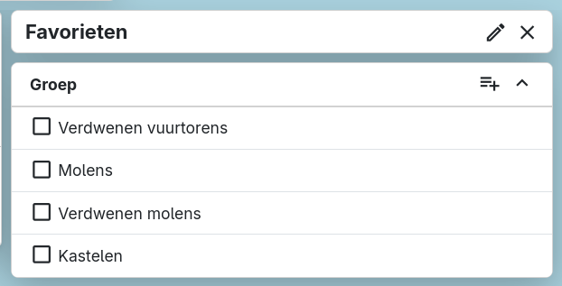
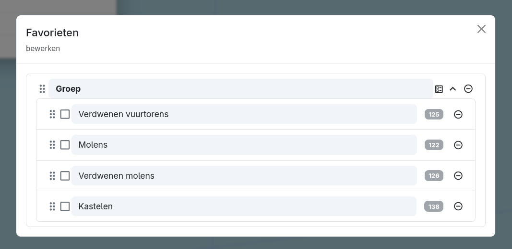

De favorieten functie van MapGallery stelt gebruikers in staat om specifieke kaartlagen eenvoudig toegankelijk te
maken door deze op te slaan als persoonlijk favoriet. De kaartlagen kunnen worden ingedeeld in eigen groepen.
Hieronder volgt een beschrijving van hoe deze functionaliteit werkt.

### Kaartlaag markeren als favoriet

Via het [Kaartlagen (C)](../map/#kaartviewer) paneel kunnen specifieke kaartlagen eenvoudig toegankelijk gemaakt worden
door deze op te slaan als persoonlijke favoriet. Via onderstaande stappen kan een kaartlaag worden gemarkeerd als
favoriet.

1. Zorg dat je ingelogt bent in de MapGallery omgeving. 
1. Zoek een kaartlaag en voeg deze toe, zie ook de [**Zoekfunctie**](../quick_search/) van deze documentatie voor een
   beschrijving.
1. Zorg dat de kaartlaag is uitgeklapt via de **collapse** knop.
1. Klik op de de drie puntjes  en dan favoriet knop  van de specifieke kaartlaag.
1. De kaartlaag wordt nu toegevoegd aan de favorietenlijst aan de linkerzijde onder de bookmarks knop . De knop verandert nu in een gekleurde bladwijzer  als indicatie dat de kaartlaag favoriet is.

Wanneer een kaartlaag niet meer favoriet is, kan op de favoriet-knop worden geklikt om deze te verwijderen uit de
favorietenlijst.

!!! note
      Het is mogelijk om een kaartlaag te markeren als favoriet inclusief een bepaalde filtering. Pas eerste
      de [Filtering](../filter) toe op de kaartlaag en markeer de kaart vervolgens als favoriet.

### Toegang tot favorieten

Gebruikers kunnen hun favorieten terugzien onder de bookmarks knop  aan de linkerzijde van het scherm, via het favorieten venster. Klik op een kaartlaag om deze aan de kaarviewer toe te voegen.

1. Om een kaartlaag toe te voegen, klik op de naam van de kaartlaag.
    * De kaartlaag wordt toegevoegd aan de [**Kaartviewer**](../map).
    * Klik nogmaals op deze kaartlaag op deze kaartlaag te sluiten. 

2. Je kunt alle kaartlagen uit een groep in één keer toevoegen door op de **Groep toevoegen** knop () te klikken. Alle kaartlagen uit die groep worden dan toegevoegd aan de kaartviewer.

### Beheer van favorieten

Gebruikers kunnen hun favorieten zelf beheren en onder groepen indelen. Favorieten kunnen eenvoudig worden bewerkt.

1. Zorg ervoor dat de [**Kaartviewer**](../map) actief is.
2. Klik op het favorieten symbool () om het favorieten venster te openen. En daarna op het bewerk icoon ().
3. Pas de titels aan en sleep de kaartlagen naar de gewenste volgorde. Klik op de verwijder-knop  om een kaartlaag uit de favorieten te verwijderen.
4. Klik op de **Groep** toevoegen knop om een nieuwe groep te maken waarin je kaartlagen kunt groeperen.
5. De kaartlagen binnen een groep kunnen twee soorten knoppen hebben:
      * **Checkbox**: hiermee kun je een kaartlaag aan- of uitzetten.
      * **Radio button**: hiermee kun je wisselen tussen kaartlagen. Dit maakt het mogelijk om binnen een groep slechts één kaartlaag tegelijk te tonen. Wanneer je een nieuwe laag uit de groep selecteert, wordt de eerder actieve laag automatisch uitgeschakeld.
6. Klik op de knop **Opslaan** om de wijzigingen te bewaren.