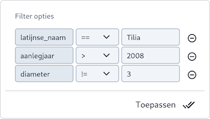

Met de filterfunctie kunnen gebruikers zoeken naar specifieke objecten binnen een kaartlaag. Deze functionaliteit is
beschikbaar voor alle **Vector**-kaartlagen.

1. Zorg ervoor dat de [**Kaartviewer**](../map) actief is.
1. Klik in de kaart op een object om Locatie-informatie op te vragen van een object. Zie voor meer
   informatie: [Locatie informatie](../mapinfo).
1. Controleer of de kaartlaag een filtersymbool heeft. Klik op het filtersymbool () naast het attribuut
   dat je wilt filteren.
1. Het is mogelijk om het filter uit te breiden door op meerdere filteropties te klikken.
1. Het kaartbeeld zal direct worden bijgewerkt met de filterwaarden.

Actieve filters worden getoond in de legenda van de kaartlaag. Dit geeft aan dat een filter actief is.

### Filter opties

Wanneer een filter actief is, verschijnt in de legenda van de kaartlaag een filtersymbool . Door op het symbool te
klikken, kan het actieve filter worden aangepast.

Afhankelijk van het type data kun je verschillende vergelijkingsopties gebruiken:

* **Tekstvelden**: Hier kun je filteren op basis van exacte matches (==) of uitsluitingen (!=).
* **Numerieke** velden: Naast exacte match en uitsluiten, kun je kiezen voor groter dan (>) of kleiner dan (<) om numerieke
  waardes te filteren.

Klik op **Toepassen** om de aanpassing op de kaart te zien.

Klik alle filters regels weg om de filtering op te heffen.

!!! note
    Het is mogelijk om een kaartlaag te markeren als [Favoriet](../favorites) inclusief een bepaalde filtering. Pas eerste
    de filtering toe op de kaartlaag en markeer de kaart vervolgens als [Favoriet](../favorites).