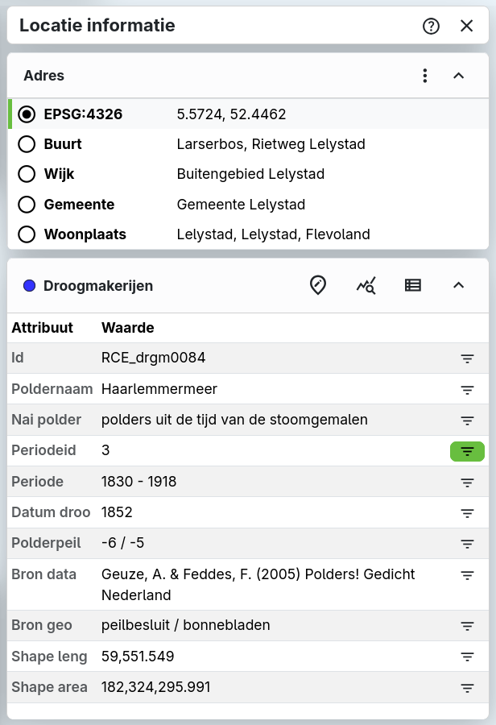
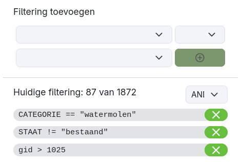

Met de filterfunctie kunnen gebruikers zoeken naar specifieke objecten binnen een kaartlaag. Deze functionaliteit is
beschikbaar voor alle **Vector**-kaartlagen.

1. Klik in de kaart op een object om Locatie-informatie op te vragen van een object. Zie voor meer
   informatie: [B. Kaart](../mapinfo).
1. Controleer of de kaartlaag een filtersymbool heeft. Klik op het filtersymbool () naast het attribuut
   dat je wilt filteren.
1. Het is mogelijk om het filter uit te breiden door op meerdere filteropties te klikken.
1. Het kaartbeeld zal direct worden bijgewerkt met de filterwaarden.

### Filter opties

Actieve filters worden weergegeven in de legenda van de kaartlaag, onder de filterknop . Wanneer deze knop in de legenda gekleurd is, betekent dit dat er een filter actief is. Door op de knop te klikken, krijg je per kaartlaag een overzicht van de actieve filters. De filters kunnen hier ook worden aangepast.

Afhankelijk van het type data kun je verschillende vergelijkingsopties gebruiken:

* **Tekstvelden**: Hier kun je filteren op basis van exacte matches (`==`), uitsluitingen (`!=`) of een substring (`bevat`).
* **Numerieke** velden: Je kunt filteren op waarden die groter dan (`>`), kleiner dan (`<`), groter dan of gelijk aan (`>=`), of kleiner dan of gelijk aan (`<=`) een bepaalde waarde zijn.

Boven de filterregels kun je kiezen tussen `AND` en `OR` om aan te geven hoe de filters met elkaar worden gecombineerd. Verwijder alle filterregels om de filtering op te heffen.

!!! note
    Het is mogelijk om een kaartlaag te markeren als [Favoriet](../favorites) inclusief een bepaalde filtering. Pas eerste
    de filtering toe op de kaartlaag en markeer de kaart vervolgens als [Favoriet](../favorites).