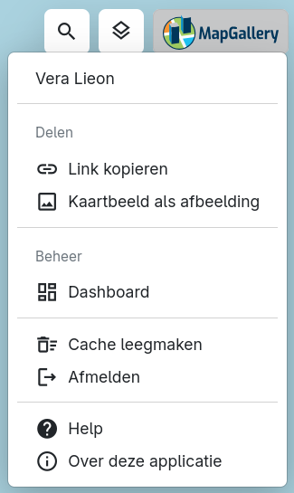

Via het [Hoofdmenu (A)](../map/#kaartviewer) rechtsboven in de applicatie als je op het MapGallery logo klikt, vind je een navigatiemenu waarmee je snel toegang krijgt tot de verschillende onderdelen van de applicatie, zoals delen, [cache legen](../cache/index.md), afmelden, help en meer informatie over de applicatie. 

### Delen van het kaartbeeld
Het huidige kaartbeeld kan op verschillende manieren worden opgeslagen of gedeeld. Zo kun je bijvoorbeeld een afbeelding van de kaart maken of een link naar het huidige kaartbeeld delen.

Voor een uitgebreide uitleg over de mogelijkheden om het kaartbeeld en andere gegevens te exporteren, zie [Exporteren](../export/#exporteer-kaartbeeld).