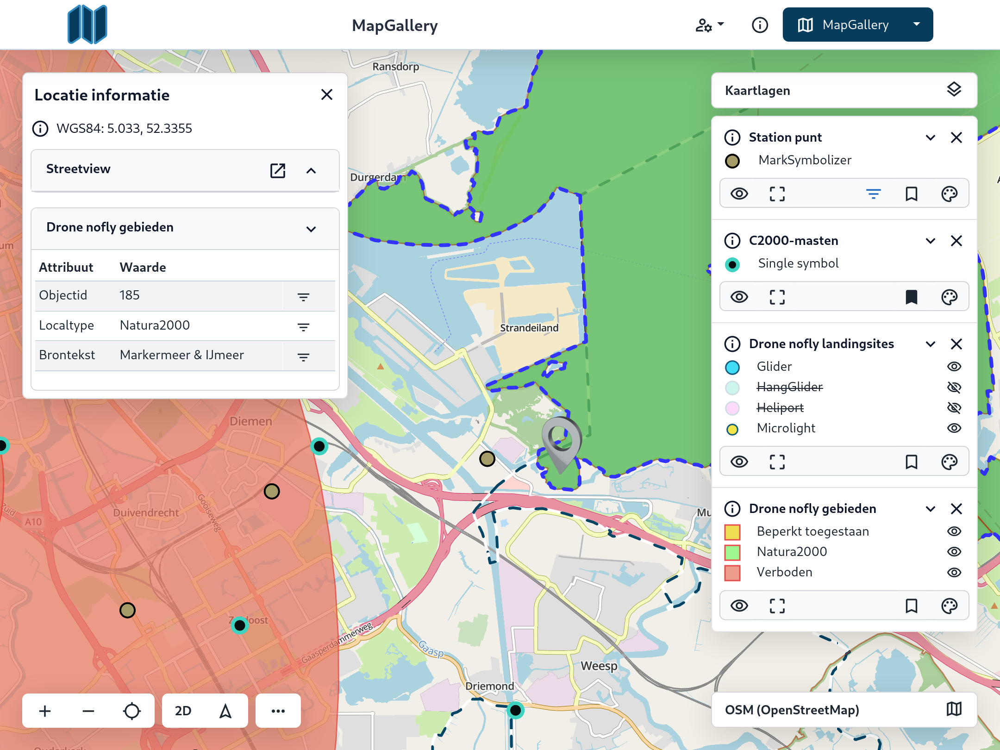

# Aan de slag met MapGallery als gebruiker

Deze documentatie beschrijft de verschillende onderdelen van de MapGallery-gebruikersomgeving en hoe je deze effectief kunt gebruiken.

### Uitnodiging

Je bent uitgenodigd voor MapGallery. Als het goed is, heb je een uitnodigingsmail ontvangen met een link om in te
loggen. Klik op de link in de e-mail om toegang te krijgen.

#### Inloggen

Na registratie kun je inloggen op MapGallery via de link in de uitnodigingsmail. Vanaf daar kun je navigeren naar de
gewenste omgeving.

1. Klik op de URL die je per e-mail van MapGallery hebt ontvangen om naar het inlogscherm te gaan..
1. Voer de **Gebruikersnaam** en het **Wachtwoord** in die je per e-mail van MapGallery hebt ontvangen.
1. Klik op **Aanmelden**.

!!! note
    Afhankelijk van de instellingen van MapGallery binnen je organisatie kan het zijn dat je automatisch wordt ingelogd bij
    het openen van de applicatie.

### De belangrijkste kenmerken en functionaliteiten

De basis van MapGallery bestaat uit een statische (wereld) **kaart**. Over deze kaart kunnen interactieve **kaartlagen**
geprojecteerd worden. Een kaartlaag bevat een visualisatie van specifieke geografische data. Dit kan van alles zijn,
bijvoorbeeld de locaties van bluswatervoorzieningen of zorginstellingen, maar ook een visualisatie van de actuele
verkeersinformatie of een digitale weergave van het aardoppervlak met oppervlaktetopografie.

MapGallery bevat een veelzijdig **zoekveld**, waarmee je naar coördinaten, adressen, kaartlagen, ondergronden of
gegevens kunt zoeken. Ook beschikt de kaart over verschillende weergavefuncties, zoals een 2D- en 3D-weergave, in- en
uitzoomen, ondergrond veranderen en locatie- en oriëntatiebepaling. Daarnaast is het mogelijk om op de kaart metingen
uit te voeren, selecties te maken, afbeeldingen te exporteren naar PNG-formaat of te delen via een link (URL).