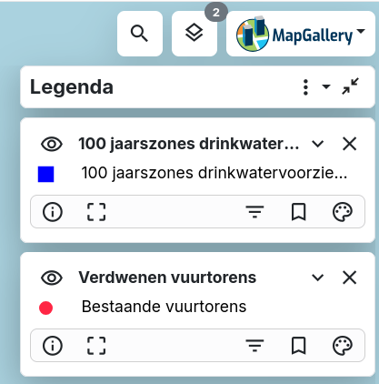
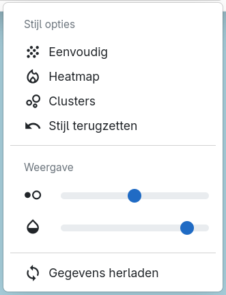
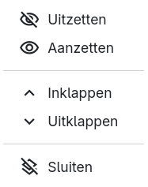
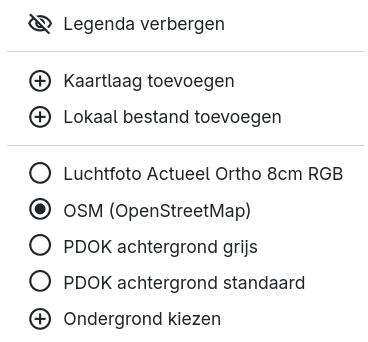

Het [Kaartlagen (C)](../map/#kaartviewer) paneel geeft je volledige controle over de actieve kaartlagen die worden
weergegeven op de kaart. In dit gedeelte van de handleiding leggen we uit hoe je de verschillende functies binnen dit
paneel kunt gebruiken om actieve kaartlagen te beheren.

Elke actieve kaartlaag wordt weergegeven in dit paneel. Een kaartlaag kan worden in- en uitgeklapt via de **collapse**
knop (/) en worden gesloten door op de **sluiten** knop () te klikken. Door te **slepen** kan
de volgorde van de kaartlagen worden aangepast. Elke laag heeft specifieke opties voor weergave en interactie.

## Legenda

Elke kaartlaag biedt een interactieve legenda met een aantal interactieve knoppen waarmee je de laag kunt beheren:

### Kaartlagen

De kleuren en symbolen naast elke kaartlaag geven een visuele weergave van de categorieën binnen de laag. Door op een legenda-item te klikken wordt het item aan- of uitgezet.

### Metadata

De metadata knop () geeft extra kermerken over de kaartlaag.

### Zichtbaarheid

Dit icoon () bepaalt of een kaartlaag zichtbaar is op de kaart. Door op het oogpictogram
te klikken, kun je de laag aan- of uitzetten. Dit is handig als je tijdelijk een laag wilt verbergen zonder deze
volledig te verwijderen.

### Zoom

Zoom naar laag of actieve filtering: Klik op het icoon () om automatisch in te zoomen op het volledige gebied dat door de
kaartlaag wordt gedekt. Als er een actieve filtering is, wordt ingezoomd op het gebied dat door het filter wordt
bepaald.

### Favoriet

Met het bladwijzer-icoon () kun je een kaartlaag markeren als favoriet. Dit stelt je in
staat om snel terug te keren naar deze laag zonder steeds door de volledige lijst van lagen te moeten zoeken.

### Stijl

Door op dit pictogram () te klikken, kun je de weergave-instellingen van de kaartlaag aanpassen. Dit
omvat
het wijzigen van kleuren, symbolen, en andere visuele aspecten om de laag beter aan te passen aan je specifieke
analysebehoeften.

### De style aanpassen

Bij een vectorkaartlaag kan de style worden aangepast, evenals de transparantie en dikte van symbolen. Hieronder volgt
een gedetailleerde uitleg van de beschikbare opties in dit menu.

- **Eenvoudig.** Kies deze optie om een eenvoudige, standaardweergave te gebruiken voor de kaartlaag. Dit is de
  basisstijl zonder speciale effecten of aanpassingen.
- **Heatmap.** Met de Heatmap-optie (hittekaart) kun je gegevens visualiseren op basis van dichtheid. Hoe meer data er
  in een bepaald
  gebied is, hoe intenser de kleur. Dit is vooral nuttig voor het weergeven van concentraties in grote datasets.
- **Clusters.** Deze optie groepeert dicht bij elkaar liggende punten tot clusters, afhankelijk van het zoomniveau.
  Clustering is handig wanneer je met veel punten werkt, omdat het een overzichtelijke weergave biedt zonder dat de
  kaart overladen raakt.

 

- **Stijl terugzetten.** Gebruik deze optie om alle aangepaste stijlinstellingen terug te zetten naar de oorspronkelijke
  standaardweergave.  
- **Weergave**:
    - Grootte van de symbolen (bovenste schuifregelaar): Pas de grootte van de symbolen aan met deze schuifregelaar.
    - Transparantie (onderste schuifregelaar): Met deze schuifregelaar kun je de transparantie van de kaartlaag
      aanpassen.
- **Gegevens herladen**: Deze optie zorgt ervoor dat de gegevens van de kaartlaag opnieuw worden geladen.

### Legenda opties 

Door op de 3 puntjes () bovenaan de legenda te klikken, worden de legenda-opties geopend. De volgende functionaliteiten zijn beschikbaar:

* **Uitzetten**: Met deze optie kun je alle actieve kaartlagen in één keer uitschakelen.
* **Aanzetten**: Hiermee zet je alle kaartlagen die zijn uitgeschakeld, weer aan.
* **Inklappen**: Deze optie klapt alle legenda's van de actieve kaartlagen in.
* **Uitklappen**: Met deze optie worden alle legenda's in het Kaartlagen-paneel uitgeklapt.
* **Sluiten**: Sluit alle kaartlagen.

Naast het icoon van de 3 puntjes staat het verberg-icoon (). Hiermee wordt de volledige legenda verborgen. De geopende kaartlagen blijven daarbij geopend, maar de legenda wordt niet meer weergegeven. De legenda kan vervolgens weer worden geopend via het kaartlagenpaneel ().

## Kaartlagenpaneel

Het context menu van het Kaartlagenpaneel () biedt een aantal handige functies om de kaartlagen en kaartweergave te personaliseren. Hieronder volgt een uitleg van de verschillende opties:

* **Lengenda verbergen/tonen**: hiermee kan de legenda worden verborgen zonder dat de kaartlagen worden gesloten. De legenda kan vervolgens weer zichtbaar worden gemaakt.
* **Kaartlagen toevoegen**: hiermee word je direct naar het zoekvenster doorgestuurd om kaartlagen toe te voegen.
* **Lokaal bestand importeren**: sleep lokale bestanden hierheen of klik om een bestand te selecteren. De volgende bestandstypen worden ondersteund: CSV, Shapefile (zip), GeoJSON, KML en GPKG.
* **Ondergronden**:hiermee kun je de actieve ondergrond van de kaart wijzigen.

### Ondergronden

Door een ondergrondkaart te selecteren, bepaal je de basisweergave van de kaart waarop andere kaartlagen worden geprojecteerd. De ondergronden in het overzicht zijn door de beheerder aangemerkt als standaardondergronden en worden als beschikbare opties weergegeven.

De actieve ondergrond is gemarkeerd met een bolletje. Door op een andere ondergrond in de lijst te klikken, wissel je de actieve basislaag.

#### Ondergrond kiezen
Gebruik deze optie om alle beschikbare ondergrondkaarten te bekijken. Er wordt een pop-upvenster geopend van het zoekvenster met een volledige lijst van de beschikbare ondergronden. Selecteer een ondergrond om deze als basislaag voor de kaartweergave te gebruiken.
