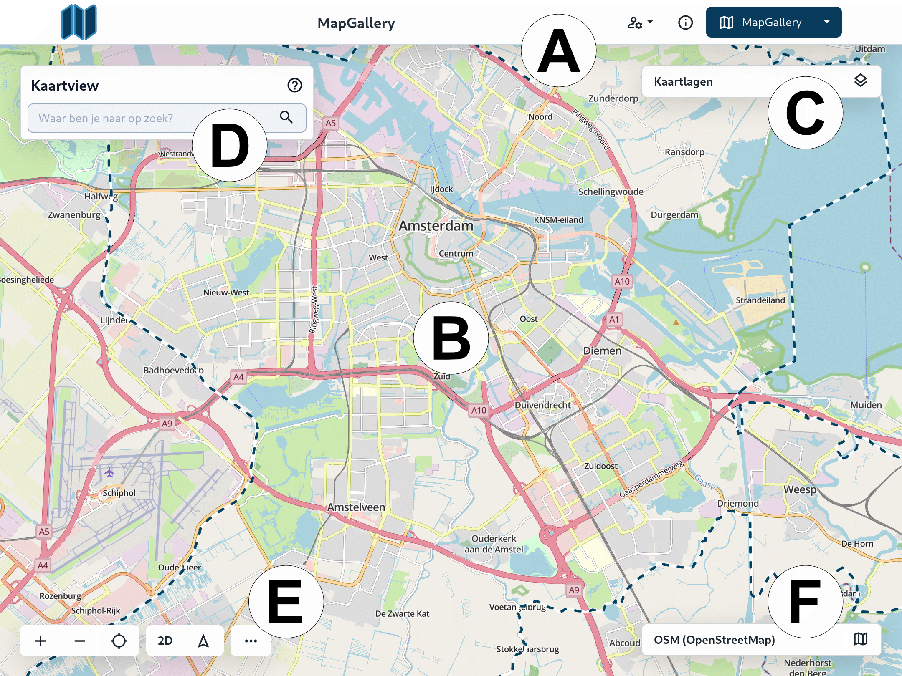

Deze handleiding geeft een overzicht van de verschillende onderdelen van de kaartinterface in MapGallery, zoals
aangegeven op de kaart. Elk gemarkeerd gebied (A-F) biedt belangrijke functionaliteiten voor het navigeren en gebruiken
van de kaartweergave.



2. Kies **Kaart** uit het menu.

Het is ook mogelijk om direct op de knop **MapGallery** te klikken.

## Kaartviewer

De Kaartviewer is een gebruiksvriendelijke tool voor het verkennen van geografische informatie. Met deze interactieve
kaart kunnen gebruikers eenvoudig geografische informatie verkennen en analyseren.

### A. Hoofdmenu

Het hoofdmenu geeft toegang tot de verschillende onderdelen van MapGallery, zoals je profielinstellingen, documentatie,
en andere belangrijke functies. Je kunt via het menu snel navigeren naar verschillende secties binnen MapGallery.

Zie voor meer informatie het onderdeel [Hoofdmenu](../header/).

### B. Kaart

Het centrale gedeelte van de interface is de kaartweergave. Hier kun je inzoomen, uitzoomen en de kaart verplaatsen om
verschillende geografische gebieden te verkennen. De kaart biedt een visuele weergave van de geselecteerde kaartlagen.

Zie voor meer informatie het onderdeel [Kaart](../mapinfo/).

### C. Kaartlagen

Aan de rechterkant bevindt zich het Kaartlagen paneel. Hier kun je kiezen welke kaartlagen je wilt weergeven op de
kaart.
Door op het icoon te klikken, kun je verschillende lagen in- of uitschakelen om specifieke informatie te bekijken.

Een kaartlaag is een informatielaag, bestaande uit data die een gebruiker aan en uit kan zetten. De kaartlagen kan de
gebruiker onafhankelijk van elkaar aan- en uitzetten. Afhankelijk van het protocol van de service waar de kaartlaag aan
gekoppeld is, bestaat de mogelijkheid gegroepeerde data in een kaartlaag aan of uit te zetten, te filteren of te stylen.

Zie voor meer informatie het onderdeel [Layers](../layers/).

### D. Zoekfunctie

Bovenaan links in het scherm zie je de zoekbalk waarmee je snel naar specifieke locaties kunt zoeken. Typ een locatie of
trefwoord in, en MapGallery zoomt automatisch in op het betreffende gebied.

Zie voor meer informatie het onderdeel [Zoekfunctie](../quick_search/).

### E. Tools

Linksonder in het scherm bevindt zich de kaartnavigatie plus extra tools met de volgende functionaliteiten:

* Zoomknoppen: Hiermee kun je in- en uitzoomen op de kaart.
* 2D/3D-modus: Schakel tussen de 2D-weergave en de 3D-weergave voor een gedetailleerder perspectief van het terrein.
* Meer opties: Klik op de drie puntjes voor extra kaartopties, zoals het meten van afstanden of het toevoegen van
  markers.

Zie voor meer informatie het onderdeel [Tools](../tools/).

### F. Ondergronden

Rechtsonder zie je de ondergrondkaart die actief als basislaag in de kaartweergave. Zie voor meer informatie het onderdeel [Ondergronden](../background/).
