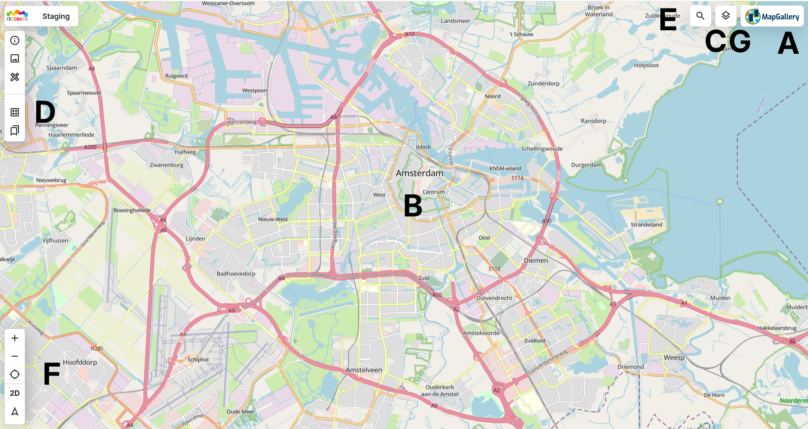

Deze handleiding geeft een overzicht van de verschillende onderdelen van de kaartinterface in MapGallery, zoals
aangegeven op de kaart. Elk gemarkeerd gebied (A-F) biedt belangrijke functionaliteiten voor het navigeren en gebruiken
van de kaartweergave.

## Kaartviewer

De Kaartviewer is een gebruiksvriendelijke tool voor het verkennen van geografische informatie. Met deze interactieve
kaart kunnen gebruikers eenvoudig geografische informatie verkennen en analyseren.

### A. Hoofdmenu

Het hoofdmenu geeft toegang tot de verschillende onderdelen van MapGallery, zoals je profielinstellingen, documentatie,
en andere belangrijke functies. 

Zie voor meer informatie het onderdeel [Hoofdmenu](../header/).

### B. Kaart

Het centrale gedeelte van de interface is de kaartweergave. Hier kun je inzoomen, uitzoomen en de kaart verplaatsen om
verschillende geografische gebieden te verkennen. De kaart biedt een visuele weergave van de geselecteerde kaartlagen.

Zie voor meer informatie het onderdeel [Kaart](../mapinfo/).

### C. Kaartlagen

Aan de rechterkant bevindt zich het Kaartlagenpaneel (). Hier kun je kaartlagen in- en uitschakelen en de ondergrondkaart veranderen.

Een kaartlaag is een informatielaag met geografische data die je onafhankelijk van andere kaartlagen kunt aan- en uitzetten. Afhankelijk van de gekoppelde service kun je gegevens binnen een kaartlaag ook filteren of stylen.

Zie voor meer informatie het onderdeel [Kaartlagen](../layers/).

### D. Collecties

Via het menu linksboven kun je het collecties paneel () openen. Hier zie je welke collectie momenteel geopend is en kun je zoeken naar andere beschikbare collecties. Een collectie bestaat uit één of meer kaartlagen die samen een thematische kaart vormen. Door op een collectie te klikken, wordt deze geopend en toegevoegd aan de kaart.

Zie voor meer informatie het onderdeel [Collecties](../collections/).

### E. Zoekfunctie

Bovenaan rechts in het scherm zie je het icoon van een vergrootglas () waarmee je snel naar specifieke locaties kunt zoeken. Typ een locatie of
trefwoord in, en MapGallery zoomt automatisch in op het betreffende gebied.

Zie voor meer informatie het onderdeel [Zoekfunctie](../quick_search/).

### F. Tools

Linksonder in het scherm bevindt zich de kaartnavigatie plus extra tools met de volgende functionaliteiten:

* Zoomknoppen: Hiermee kun je in- en uitzoomen op de kaart.
* 2D/3D-modus: Schakel tussen de 2D-weergave en de 3D-weergave voor een gedetailleerder perspectief van het terrein.
* Noordpijl: Hiermee kun je de oriëntatie van de kaart bepalen.
* Eigen locatie: Hiermee kun je je huidige locatie op de kaart bekijken.

Zie voor meer informatie het onderdeel [Tools](../tools/).