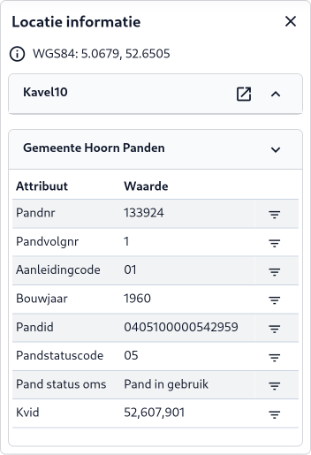

Wanneer je op een locatie in de [Kaart (B)](../map/#b-kaart) klikt, verschijnt het Locatie informatie-paneel links. Hier krijg je
gedetailleerde informatie over de geselecteerde locatie. Elk paneel is inklapbaar. De volgende elementen zijn zichtbaar
in dit paneel.

#### Coördinaten

De WGS84-coördinaten van de geselecteerde locatie worden bovenaan weergegeven. Door op het coordinaat te klikken wordt
een pop-upscherm getoond met coordinaten in de projecties Web Mercator (EPSG:3857), WGS84 (EPSG:4326) en
Rijksdriehoekstelsel (EPSG:28992).

#### Streetview

Als deze functie is ingeschakeld, kun je een straatweergave van de locatie bekijken. Klik op het icoontje om Streetview
te openen in een nieuw venster.

#### Kavel10

Als deze functie is ingeschakeld, kun je oblique foto's van de locatie bekijken. Klik op het icoontje om de oblique
te openen in een nieuw venster.

#### Attribuut-gegevens

Dit geeft specifieke attribuut informatie over de locatie van de kaartlaag.

!!! note
    Een marker geeft de geselecteerde locatie op de kaart weer en in het zoekveld verschijnt alle relevante informatie van
    de geselecteerde locatie. Klik op een andere locatie op de kaart of versleep de marker naar een nieuwe locatie voor
    andere informatie.

