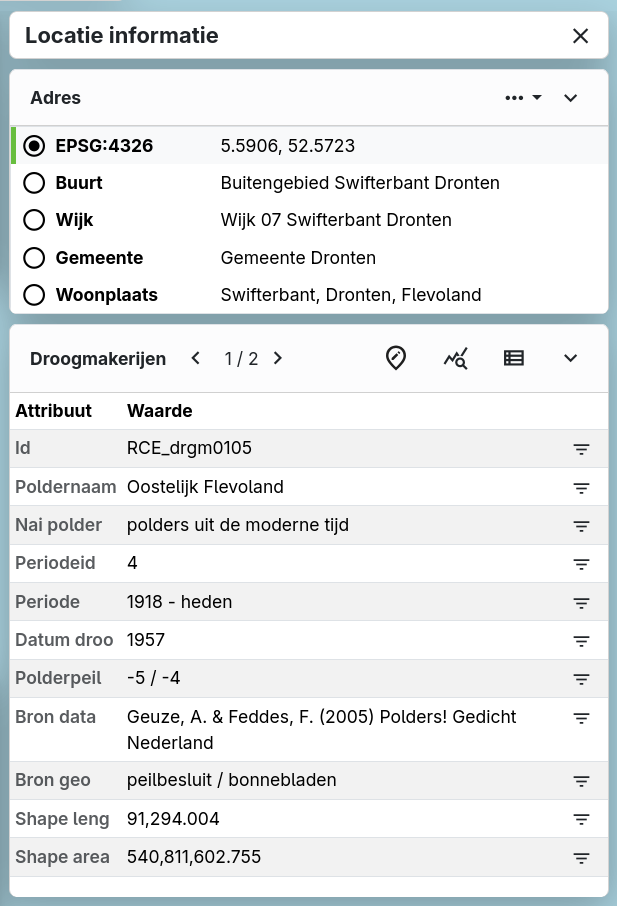

Het centrale gedeelte van de interface is de [Kaart (B)](../map/#kaartviewer). Hier kun je inzoomen, uitzoomen en de kaart verplaatsen om verschillende geografische gebieden te verkennen.

Wanneer je op een locatie in de kaart klikt, verschijnt het **Locatie informatiepaneel** links. Hier krijg je
gedetailleerde informatie over de geselecteerde locatie. Elk paneel is inklapbaar. De volgende elementen zijn zichtbaar
in dit paneel.

#### Coördinaten

De WGS84-coördinaten van de geselecteerde locatie worden bovenaan weergegeven. Door op het icoon van de drie puntjes () te klikken wordt een dropdownmenu getoond met coördinaten in de projecties Web Mercator (EPSG:3857), WGS84 (EPSG:4326) en Rijksdriehoekstelsel (EPSG:28992).

#### Attribuutgegevens

Hier wordt specifieke attribuutinformatie over de locatie van de kaartlaag weergegeven.

!!! note
    Een marker geeft de geselecteerde locatie op de kaart weer en in het Locatie informatiepaneel verschijnt alle relevante informatie van de geselecteerde locatie. Klik op een andere locatie op de kaart of versleep de marker naar een nieuwe locatie voor andere informatie.

#### Street View

Als deze functie is ingeschakeld, kun je een straatweergave van de locatie bekijken. Klik op het icoon om Street View
te openen in een nieuw venster.

#### Kavel10

Als deze functie is ingeschakeld, kun je oblique foto's van de locatie bekijken. Klik op het icoontje om de de oblique weergave
te openen in een nieuw venster.
