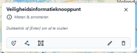

De **Kaart opties** bij [Kaartnavigatie & Tools (E)](../map/#e-kaartnavigatie-tools) bieden de mogelijkheid om te meten
en te annoteren op de kaart. Volg onderderstaande stappen om dit te kunnen doen.

1. Zorg ervoor dat de [**Kaartviewer**](../map) actief is. 

2. Klik bij [Kaartnavigatie & Tools (E)](../map/#e-kaartnavigatie-tools) op het uitklapmenu () en kies vervolgens **Meten & Annoteren**.

3. Het Meten & Annoteren venster verschijnt met drie opties:
     - Klik op  voor **coördinaten.** Klik op een gewenste locatie op de kaart om de coördinaten van die
     locatie weer te geven.
     - Klik op  voor **afstanden.** Klik op de **kaart** op een gewenst beginpunt en klik vervolgens op een
   gewenst eindpunt om de afstand hemelsbreed weer te geven.
     - Klik op  voor **oppervlak.** Klik op de **kaart** op een beginpunt dat zich aan de rand bevindt van
   een gewenst gebied, waarvan je het oppervlak wilt meten. Klik op meerdere punten aan de rand van het gebied en
   dubbelklik om de selectie te sluiten. Het oppervlak wordt weergegeven in vierkante kilometer.

4. Lorem ipsum dolor sit amet, consectetur adipiscing elit, sed do eiusmod tempor incididunt ut labore et dolore magna aliqua. Ut enim ad minim veniam, quis nostrud exercitation ullamco laboris nisi ut aliquip ex ea commodo consequat. Duis aute irure dolor in reprehenderit in voluptate velit esse cillum dolore eu fugiat nulla pariatur. Excepteur sint occaecat cupidatat non proident, sunt in culpa qui officia deserunt mollit anim id est laborum.

