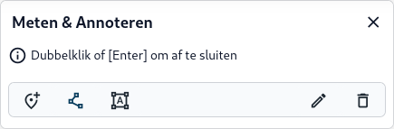

De **Kaart opties** bij [Tools (E)](../map/#e-kaartnavigatie-tools) bieden de mogelijkheid om te meten
en te annoteren op de kaart. Volg onderderstaande stappen om dit te kunnen doen.

1. Zorg ervoor dat de [**Kaartviewer**](../map) actief is. 

2. Klik bij [Tools (E)](../map/#e-kaartnavigatie-tools) op het uitklapmenu () en kies vervolgens **Meten & Annoteren**.

3. Het Meten & Annoteren venster verschijnt met drie opties:
     - Klik op  voor **coördinaten.** Klik op een gewenste locatie op de kaart om de coördinaten van die
     locatie weer te geven.
     - Klik op  voor **afstanden.** Klik op de **kaart** op een gewenst beginpunt en klik vervolgens op een
   gewenst eindpunt om de afstand hemelsbreed weer te geven.
     - Klik op  voor **oppervlak.** Klik op de **kaart** op een beginpunt dat zich aan de rand bevindt van
   een gewenst gebied, waarvan je het oppervlak wilt meten. Klik op meerdere punten aan de rand van het gebied en
   dubbelklik om de selectie te sluiten. Het oppervlak wordt weergegeven in vierkante kilometer.

4. De resultaten worden getoond in een popup op de kaart. Klik op de popup om de tekst aan te passen naar een **Annotatie**.

5. Klik op de **verwijder** knop om alle annotaties te wissen en opnieuw te beginnen.

