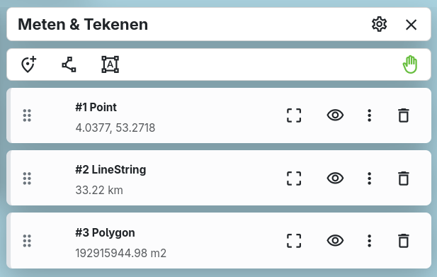

De tool Meten & Tekenen, linksboven () biedt de mogelijkheid om afstanden, oppervlakken en coördinaten op de kaart te meten. Volg onderstaande stappen om de tool te gebruiken.

- Het venster Meten & Annoteren verschijnt met drie opties:
     - Klik op  voor **coördinaten.** Klik op een gewenste locatie op de kaart om de coördinaten van die
     locatie weer te geven.
     - Klik op  voor **afstanden.** Klik op de **kaart** op een gewenst beginpunt en klik vervolgens dubbel op een gewenst eindpunt om de afstand hemelsbreed weer te geven in meters.
     - Klik op  voor **oppervlak.** Klik op de **kaart** op een beginpunt dat zich aan de rand bevindt van een gewenst gebied, waarvan je het oppervlak wilt meten. Klik op meerdere punten en dubbelklik om de selectie te sluiten. Het oppervlak wordt weergegeven in vierkante kilometer.

Om de annotatie te veranderen klik je eerst op of in de annotatie, wanneer de annotatie vervolgens oranje wordt, kan de annotatie verplaatst worden over de kaart.

#### Eeenheden aanpassen
Via het tandwielpictogram () kun je de eenheden voor afstanden en oppervlakken aanpassen. Voor afstanden kun je kiezen uit meter, kilometer, mijl en zeemijl. Voor oppervlakken kun je kiezen uit vierkante meter, vierkante kilometer, vierkante mijl en hectare.

#### Annotaties beheren
- Met de cropknop () zoom je in op de annotatie.
- Met het oogpictogram () kun je een annotatie verbergen en weer zichtbaar maken.
- Klik op de drie puntjes () bij een annotatie om extra opties te openen. Je kunt de annotatie onder andere overnemen naar locatie informatie. Hiermee kun je bekijken welke objecten binnen de annotatie vallen, een export downloaden of de statistieken tonen. Zie hiervoor ook de pagina [Selecteren](../selection).
- Daarnaast kun je een GeoJSON-bestand van de annotatie exporteren. 
- Ook kun je een buffer rond de annotatie maken met een zelfgekozen afstand.
- Klik op de knop Verwijderen om de annotaties te wissen en opnieuw te beginnen.

!!! note
    De gemaakte annotaties worden automatisch opgeslagen. Ze blijven behouden wanneer de browser wordt vernieuwd of wanneer je de applicatie de volgende dag opnieuw opent. De annotaties worden pas verwijderd wanneer je op de verwijderknop klikt.