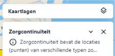
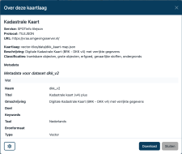

Het [Kaartlagen (C)](../map/#c-kaartlagen) paneel geeft een overzicht van de actieve kaartlagen die worden
weergegeven op de kaart. Via dit paneel kan van Metadata worden opgevraagd.

Overzicht van het Kaartlagen-paneel

menu-legend.png

Elke actieve kaartlaag wordt weergegeven in dit paneel. Een kaartlaag kan worden in- en uitgeklapt via de **collapse**
knop en worden gesloten door op de **sluiten** knop () te klikken. Door te **slepen** kan de volgorde van de
kaartlagen worden aangepast. Elke laag heeft specifieke opties voor weergave en interactie.

### Metadata

3. Klik op  linksboven in de uitgeklapte **kaartlaag.** Er verschijnt een pop-upscherm met informatie over de kaartlaag.

!!! note
Het pop-upscherm bevat alle beschikbare technische details over de kaartlaag.
 

4. Klik op **Download** om de gegevens van de kaartlaag te downloaden in verschillende formaten.

!!! note
  Het hangt van de service af of dit is toegestaan en in welke formaten.

  
