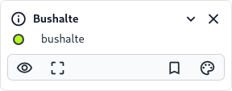

Via het [Kaartlagen (C)](../map/#kaartviewer) paneel is van elke actieve kaartlaag metadata op te vragen. Volg de
onderstaande stappen om toegang te krijgen tot deze informatie:

1. Zorg ervoor dat de [**Kaartviewer**](../map) actief is.
2. Zoek een kaartlaag en voeg deze toe, zie ook de [**Zoekfunctie**](../quick_search/) van deze documentatie voor een beschrijving.
3. Zorg dat de kaartlaag is uitgeklapt via de via de **collapse** knop.
4. Klik op de info knop  van een specifieke kaartlaag.
5. Dit opent een venster met meer informatie over de laag. Zodra het venster "Over deze kaartlaag" verschijnt, kun je
   verschillende soorten metadata bekijken. Deze metadata bevat belangrijke informatie over de geselecteerde dataset.

| Naam             | Beschrijving                                                                                              |
|------------------|-----------------------------------------------------------------------------------------------------------|
| `Service`        | De naam van de bron of server van de kaartlaag.                                                           |
| `Protocol`       | Het bestandsformaat of gebruikte protocol van de service.                                                 |
| `URL`            | De URL van de bron of server.                                                                             |
| `Kaartlaag`      | De naam van de kaartlaag                                                                                  |
| `Omschrijving`   | Een korte beschrijving van wat de kaartlaag bevat                                                         |
| `Classificaties` | De (hoofd)groepen waar deze kaartlaag onder valt. Gebruik deze term om gerelateerde kaartlagen te vinden. |
| `Metadata`       | In dit deel vind je meer specifieke gegevens, zoals taal, eigenaar, datum, bronprojectie of restricties.  |

4. Indien beschikbaar, kun je de gegevens ook downloaden door op de knop "Download" te klikken.

!!! note
      Indien beschikbaar, kun je de gegevens ook downloaden via de stappen bij [Exporteren -> Kaartlaag](../export/).

  
