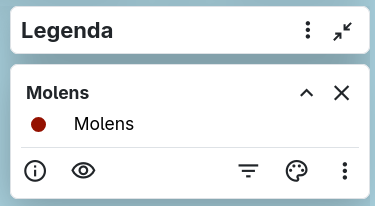

Via de legenda van het [Kaartlagen (C)](../map/#kaartviewer) paneel is van elke actieve kaartlaag metadata op te vragen. Volg de
onderstaande stappen om toegang te krijgen tot deze informatie:

1. Zoek een kaartlaag en voeg deze toe, zie ook de [**Zoekfunctie**](../quick_search/) van deze documentatie voor een beschrijving.
1. Klik op de info knop  van een specifieke kaartlaag.
1. Dit opent een venster met meer informatie over de laag. Zodra het venster verschijnt, kun je
   verschillende soorten metadata bekijken. Deze metadata bevat belangrijke informatie over de geselecteerde dataset.

| Naam              | Beschrijving                                                                                              |
|-------------------|-----------------------------------------------------------------------------------------------------------|
| `Kaartlaag`       | De naam van de kaartlaag                                                                                  |
| `Protocol`        | Het bestandsformaat of gebruikte protocol van de service.                                                 |
| `Service`         | De naam van de bron of server van de kaartlaag.                                                           |
| `Classificaties`  | De (hoofd)groepen waar deze kaartlaag onder valt. Gebruik deze term om gerelateerde kaartlagen te vinden. |
| `Omschrijving`    | Een korte beschrijving van wat de kaartlaag bevat                                                         |
| `URL`             | De URL van de bron of server.                                                                             |
| `Metadata`        | In dit deel vind je meer specifieke gegevens, zoals taal, eigenaar, datum, bronprojectie of restricties.  |

!!! note
      Indien beschikbaar, kun je de gegevens ook downloaden via de stappen bij [Exporteren -> Kaartlaag](../export/).

  
