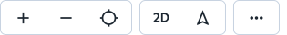
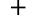
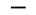
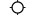

Het kaartbeeld kan eenvoudig worden verplaatst door te klikken en te slepen, en in- of uit te zoomen met de knoppen
rechtsonder of de scrollknop van je muis. Je kunt het kaartbeeld draaien door de Shift-toets ingedrukt te houden en te
slepen. Eventuele pop-ups (indien beschikbaar) kunnen worden geopend door erop te klikken.

De interactieve functies van de kaart zijn toegankelijk via het onderste menu in de interface:

- **Zoomen**: Gebruik de plus () en min () knoppen om in of uit te zoomen op de kaart.
- **Locatie**: Klik op de GPS-knop () om je huidige locatie op de kaart weer te geven.
- **Kaart draaien**: Met de rotatie knop () kun je het kaartbeeld roteren.
- **2D/3D-modus**: Schakel tussen 2D- en 3D-weergave door op de knop 2D/3D te klikken.

### Keyboardbediening

Je kunt de kaart ook eenvoudig bedienen met sneltoetsen voor nauwkeurige controle.

- **Kaart verplaatsen**: Gebruik de pijltjestoesten ++arrow-left++ ++arrow-up++ ++arrow-right++ ++arrow-down++ om de
  kaart in verschillende richtingen te verschuiven.
- **Zoomen**: Druk op ++plus++ om in te zoomen op de kaart. Druk op ++minus++ om uit te zoomen op de kaart.
- **Kaart draaien**: Druk op ++shift++ en ++arrow-left++ of ++arrow-right++ om de kaart te roteren.
- **2D/3D-modus**: Druk op ++shift++ en ++arrow-up++ of ++arrow-down++ om te wisselen tussen de 2D- en 3D-weergave.

### Muisbediening

De kaart is ook volledig te bedienen met de muis voor een intuïtieve interactie.

- **Kaart verplaatsen**: Klik en houd de **linkermuisknop** ingedrukt om de kaart te slepen en te verplaatsen.
- **Zoomen**: Draai aan het **muiswiel** om in of uit te zoomen. Houd ++shift++ ingedrukt voor nauwkeurigere
  zoomcontrole.
- **Kaart draaien**: Klik en houd de **rechtermuisknop** ingedrukt, en sleep horizontaal om de kaart te draaien.
- **2D/3D-modus**: Klik en houd de **rechtermuisknop** ingedrukt, en sleep verticaal om te wisselen tussen 2D- en
  3D-weergave.
