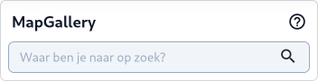

De [Zoekfunctie (D)](../map/#d-zoekfunctie) maakt het eenvoudig om specifieke kaartlagen, coördinaten en adresgegevens
te vinden. Hieronder volgt een stapsgewijze uitleg voor het gebruik van deze functie.

Stappen voor het zoeken naar een locatie:

1. **Start** de zoekfunctie: Links boven zie je de zoekbalk. Begin met het typen van een kaartlaag naam, adres of
   coördinaten om je zoekopdracht te starten.

1. Voer een **zoekterm** in: Terwijl je typt, geeft het systeem suggesties die overeenkomen met jouw zoekterm.

1. Selecteer de juiste **categorie**: De zoekresultaten worden in verschillende categorieën weergegeven:
    - **Coördinaten**: Voor ingevoerde coördinaten krijg je de mogelijke projecties die matchen.
    - **Adressen**: Toont mogelijke adressen, zoals gemeenten, steden of specifieke straten.
    - **Kaartlagen**: Hier worden relevante kaartlagen getoond die aansluiten op je zoekopdracht.
    - **Ondergronden**: Toont verschillende achtergrondkaarten, zoals luchtfoto's, topografische kaarten, of andere
      basismappen die beschikbaar zijn gesteld.
    - **Gegevens**: Geeft een match op de gegevens binnen een kaartlaag.

1. Bekijk de **resultaten**: Klik op een van de resultaten. De kaart zoomt automatisch in op de geselecteerde locatie of
   activeert de bijbehorende kaartlaag.

1. Probeer meerdere **zoektermen**: Als het resultaat niet direct zichtbaar is, probeer variaties van je zoekterm,
   bijvoorbeeld zonder afkortingen, of gebruik synoniemen.

1. **Afsluiten**: Sluit het zoeken af door op de **sluiten** knop ()  te klikken.

!!! note
      Gebruik de knop "Overzicht alle kaartlagen" of "Overzicht alle achtergronden" als je niet zeker weet welke lagen je
      nodig hebt.

## Zoekopties

### Coördinaten

Wanneer je coördinaten hebt ingevoerd, dan maakt MapGallery automatisch een match op mogelijke projecties. Klik
vervolgens
op de juiste projectie om de locatie direct op de kaart weer te geven.

### Adressen

Via de PDOK Locatieserver (geocodeerservice) wordt gezocht op gegevens uit diverse overheidsregistraties, zoals
adressen, postcodes, woonplaatsen, en provincies. Je kunt ook zoeken op perceelnummers of specifieke objecten zoals
hectometerpalen. Klikken op een resultaat selecteert de locatie of het gebied en zoomt hier op in.

Naast gewone zoekvelden kun je de zoekterm ook verder specificeren op:

* Type: zoals provincie, gemeente, woonplaats, postcode, adres, perceel, wijk, buurt, hectometerpaal, etc.
* Bron: zoals BAG (Basisregistratie Adressen en Gebouwen), NWB (Nationaal Wegen Bestand), DKK (Digitale Kadastrale
  Kaart), CBS, of HWH (Het Waterschapshuis).

#### Voorbeelden van zoekopdrachten

Adres: `Sint Jansstraat 4 Groningen`

Postcode: `1622 hp`

Perceel: `DMN00 A 220`

Hectometerpaal: `a1-100 type:hectometerpaal`

Wegtrace: `A2 bron:NWB`

Gemeente: `hoorn type:gemeente`

Zie voor uitgebreide informatie over de PDOK Locatieserver de
wiki, [gebruik van de de zoektermen](https://github.com/PDOK/locatieserver/wiki/API-Locatieserver#2-gebruik-van-zoektermen-bij-solr-services).

### Kaartlagen en Ondergronden

De zoekfunctie geeft niet alleen resultaten voor specifieke locaties, maar ook voor relevante kaartlagen en
ondergronden. MapGallery doorzoekt het volledige bestand van kaartlagen, metadata en beschrijvingen, en stelt deze
beschikbaar via een klikbaar overzicht.

### Gegevens

Alle actieve vector-kaartlagen in de Kaartviewer zijn doorzoekbaar op gegevensvelden. De tool geeft suggesties voor een
match en geeft hierbij de kaartlaag naam, het attribuut en de waarde waar op gematched is. Klikken op een resultaat
selecteert de geometrie en zoomt hier op in.

