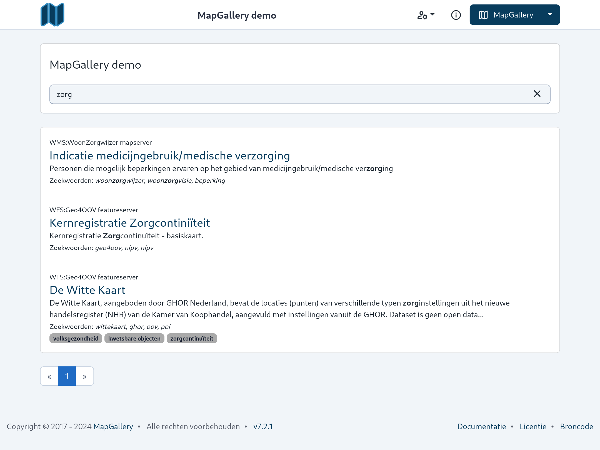

Op de zoekpagina van MapGallery kun je eenvoudig specifieke kaartlagen of datasets vinden door gebruik te maken van het
zoekveld. Hieronder vind je een stap-voor-stap uitleg over hoe je deze functionaliteit gebruikt:



2. Kies **Zoeken** uit het menu.

## Kaartlaag zoeken

### Uitgebreid zoeken naar kaartlaag

#### 1. Zoekveld gebruiken

Voer een trefwoord in het zoekveld in, zoals een onderwerp, thema of specifieke term die je zoekt. Nadat je op ++enter++
drukt of op het vergrootglas klikt, worden de resultaten direct weergegeven.

#### 2. Resultaten bekijken

De zoekresultaten worden weergegeven in een lijst onder het zoekveld. Als de zoekresultaten niet zijn wat je zoekt, kun
je eenvoudig je zoekterm wijzigen door een nieuwe term in te voeren in het zoekveld. Voor elk resultaat krijg je de
volgende informatie te zien:

* Naam van de **Service** (bron) van de kaartlaag
* **Titel** van de kaartlaag
* **Beschrijving**: Een korte uitleg van wat de kaartlaag bevat.
* **Zoekwoorden**: Relevante trefwoorden die aan de kaartlaag zijn gekoppeld, waardoor je makkelijk kunt zien waar de
  dataset over gaat.
* **Zoekwoorden**: Relevante trefwoorden die aan de kaartlaag zijn gekoppeld, waardoor je makkelijk kunt zien waar de
  dataset over gaat.
* **Classificaties**: Classificaties die aan de kaartlaag zijn gekoppeld, waardoor je makkelijk kunt zien waar de
  dataset over gaat.

Door op de classificaties te klikken, kun je vergelijkbare kaartlagen zoeken of je zoekopdracht verder verfijnen.

#### 3. Paginering

Als er meerdere resultaten zijn, kun je onderaan de lijst navigeren tussen de verschillende pagina's door op de
pijltjesknoppen te klikken.

#### 4. Resultaten selecteren

Klik op een van de zoekresultaten om meer details te bekijken of om de kaartlaag te openen en te gebruiken binnen
MapGallery.

!!! note
    De naam van de kaartlaag is ook een link naar de kaartlaag die je kunt bookmarken

