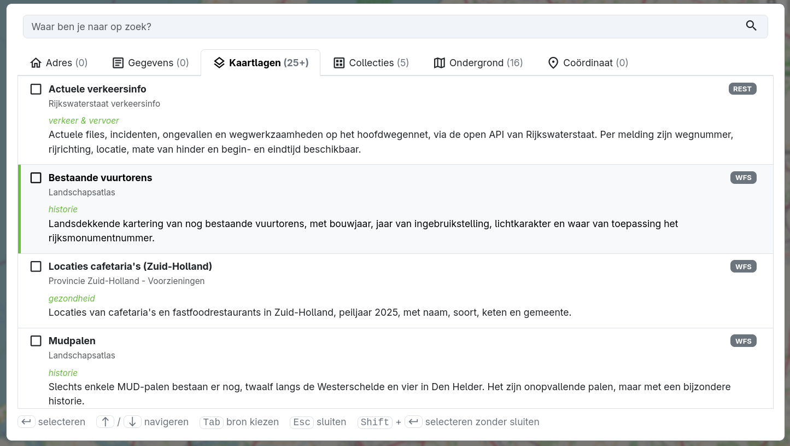

Via het zoekvenster van MapGallery kun je eenvoudig specifieke kaartlagen of datasets vinden door gebruik te maken van het zoekveld. Hieronder vind je een stap-voor-stap uitleg over hoe je deze functionaliteit gebruikt:

## Kaartlaag zoeken

### Uitgebreid zoeken naar kaartlaag

### 1. Zoekvenster
Door ++control++ + ++k++ in te drukken of rechtsboven op het vergrootglas te klikken, kom je bij het zoekvenster.
Voer een trefwoord in het zoekveld in, zoals een onderwerp, thema of specifieke term die je zoekt. Nadat je op ++enter++ drukt of op het vergrootglas klikt, worden de resultaten direct weergegeven.

### 2. Zoek categorieen
Hier kan je zoeken op een trefwoord, zoals een onderwerp, thema of specifieke term. De zoekresultaten worden weergegeven in verschillende categorieën.

1. Adres: hier worden resultaten weergegeven van adressen, postcodes, buurten, wijken, woonplaatsen, gemeenten en provincies.
2. Gegevens: hier kan je met zoekwoorden gegevens binnen de actieve kaartlagen opzoeken.
3. Kaartlagen: hier wordt gezocht naar titels, beschrijvingen, zoekwoorden en classificaties van kaartlagen.
4. Collecties: zoek naar collecties en hun beschrijving.
5. Ondergrond: zoek naar verschillende ondergrondkaartlagen.
6. Coördinaat: zoek naar coördinaatpunten op de kaart.

Klik op een van de zoekresultaten om de kaartlaag te openen en te gebruiken binnen MapGallery.

### 3. Zoekresultaten
De zoekresultaten worden weergegeven in een lijst. Als de zoekresultaten niet zijn wat je zoekt, kan je eenvoudig je zoekterm wijzigen door een nieuwe term in te voeren in het zoekveld. Voor elk resultaat krijg je de volgende informatie te zien:

* **Titel** van de kaartlaag
* Naam van de **Service** (bron) van de kaartlaag
* **Classificaties**: Classificaties die aan de kaartlaag zijn gekoppeld, waardoor je makkelijk kunt zien waar de
  dataset over gaat.
* **Beschrijving**: Een korte uitleg van wat de kaartlaag bevat.

!!! note
    De naam van de kaartlaag is ook een link naar de kaartlaag die je kunt bookmarken

