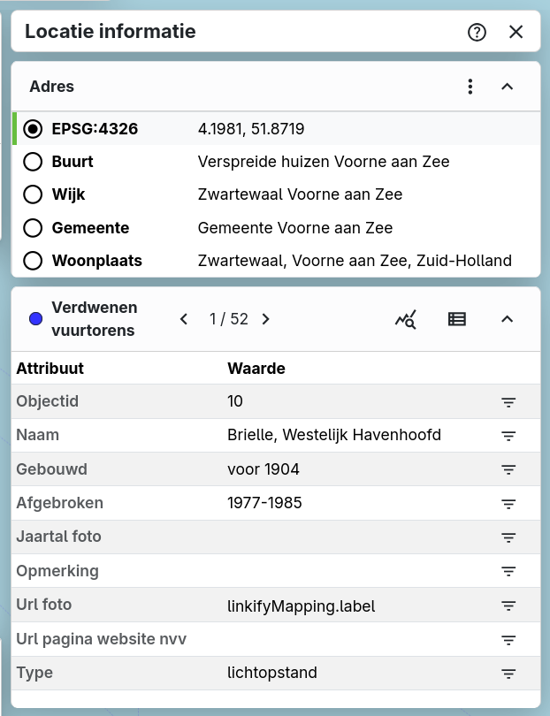

Er zijn verschillende manieren om een ruimtelijke selectie te maken:

* De Meten & Tekenen-tool, linksboven () biedt de mogelijkheid om meerdere objecten op de kaart te kunnen selecteren. Dit kun je daarna overnemen naar locatie-informatie, zie hiervoor ook de pagina [Meten & Annoteren](../measure).
* Een andere manier is om op een punt te klikken op de kaart en daarna bij locatie informatie op de buurt, wijk, gemeente of woonplaats te klikken, dit wordt dan automatisch ook een ruimtelijke selectie.
* Om een hele snelle selectie te maken, moet je het locatie informatie venster open hebben en dan kun je ++shift++ ingedrukt houden tijdens het slepen om een selectie te maken.

MapGallery maakt een ruimtelijke selectie. Vervolgens worden de totalen per kaartlaag weergegeven. Ook worden de bijbehorende attributentabellen getoond, waarin je door de gegevens kunt bladeren.

Via de knop 'statistieken tonen' () kun je verschillende statistieken per veld bekijken:

* Om de totalen uit te laten rekenen per attribute waarde, klik dan op  linksonder in menu. Selecteer een gewenste attribuut uit het uitklapmenu.

* Onder de totalen staan een aantal opties om de selectie verder te analyseren.
      *  voor een staafdiagramweergave;
      *  voor een taartdiagramweergave;

!!! note 
      De selectie kan vervolgens worden geexporteerd via de stappen bij [Exporteren -> Selectie](../export/#exporteer-selectie).